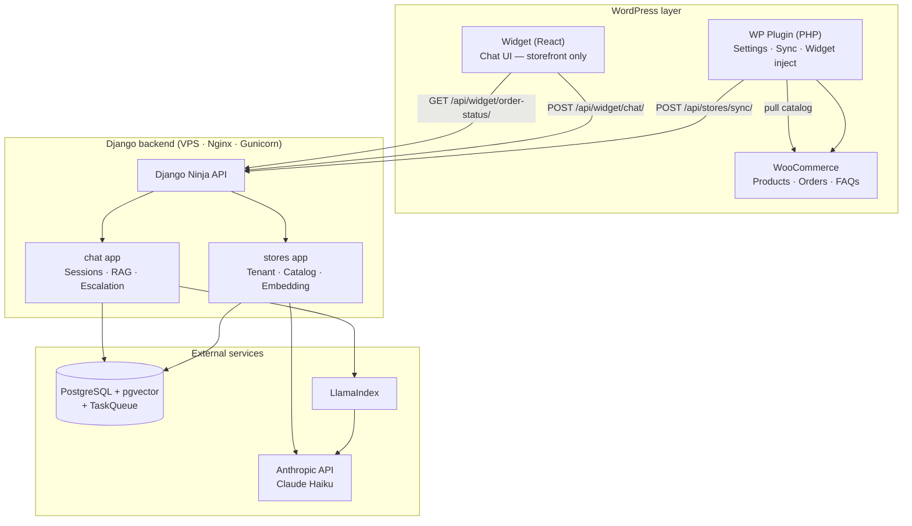
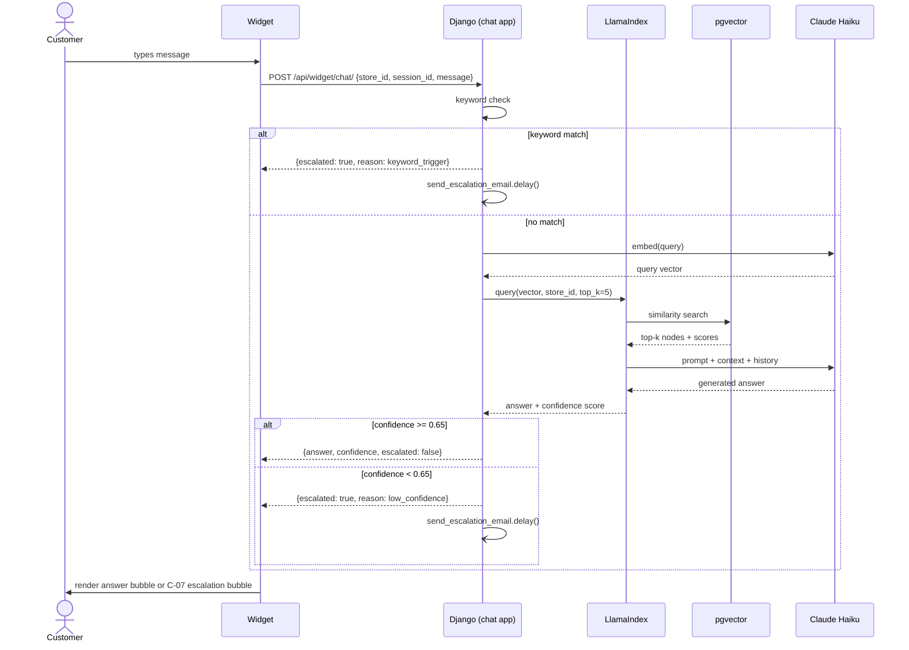
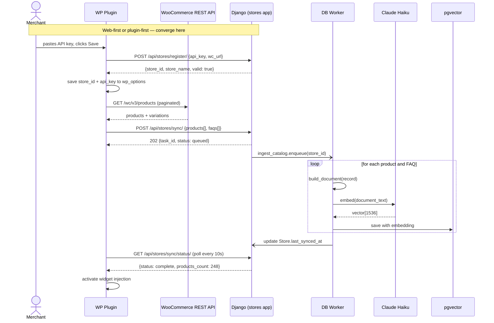
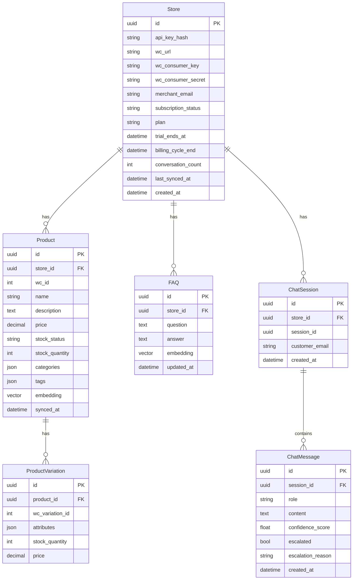
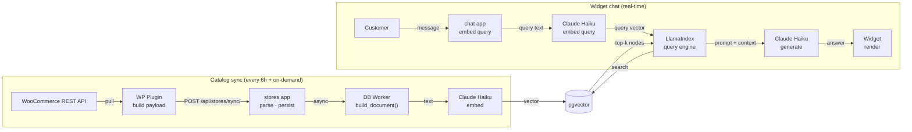

# WooCS.ai — PoC PRD

**Version:** 0.3 (PoC)
**Status:** Draft
**Scope:** Technical validation only — not production

---

## Changelog

| Version | Change |
|---|---|
| 0.3 | Merged sync + catalog apps into stores app. Renamed storefront chat to widget throughout. Fixed register vs verify endpoint conflict. Added error handling spec, rate limiting, security notes, MerchantUser clarity, build_document spec. |
| 0.2 | Added auth model, onboarding flows, subscription & billing, system diagrams. |
| 0.1 | Initial draft. |

---

## 1. Problem

WooCommerce merchants (SMB tier, <500 orders/day) handle repetitive support questions manually — product availability, stock, order status, return policy. No affordable, zero-setup solution exists that natively understands WooCommerce data without manual training.

---

## 2. Goal

Prove three technical hypotheses in 4 weeks:

| # | Hypothesis | Pass criteria |
|---|---|---|
| H1 | WooCommerce catalog can be synced reliably | 100+ products pulled and embedded in <3 min |
| H2 | RAG answers are accurate from store data | 15/20 manual queries answered correctly, no hallucination |
| H3 | Escalation to human is triggered correctly | Escalation fires when confidence < threshold; email delivered |

---

## 3. Non-goals (PoC)

- Merchant dashboard UI
- OAuth connect flow
- Billing / Polar.sh integration
- Multi-tenant isolation
- Analytics
- WP Marketplace submission
- HITL feedback loop
- MerchantUser model and dashboard login (post-PoC — store record is the identity in PoC)
- Rate limiting enforcement (soft limit defined but not enforced in PoC)
- API key rotation exposed to merchants

---

## 4. Architecture overview

Two Django apps, all connected through a single API surface:

**WordPress layer** — WP plugin (PHP) is the bridge between the merchant's store and Django. It pulls catalog data from WooCommerce REST API, forwards it to Django, and injects the widget into the storefront.

**Django backend** — two apps: `stores` (tenant management, catalog ingestion, embedding pipeline) and `chat` (sessions, RAG, escalation). Exposed via Django Ninja API. Hosted on VPS with Nginx + Gunicorn.

**External services** — PostgreSQL + pgvector for data, vector storage, and background tasks (Django 6 tasks), Anthropic API (Claude Haiku) for embeddings and chat generation, LlamaIndex as the RAG query engine layer.

**Widget** — a React bundle injected by the WP plugin into the storefront. It is the only customer-facing surface. All widget communication goes to Django Ninja API — no direct WooCommerce calls.

---

## 5. Components

### 5.1 WP Plugin (PHP)

**Responsibilities:**
- Pull catalog from WooCommerce REST API (products, variations, FAQs)
- POST catalog payload to Django `/api/stores/sync/`
- Inject widget JS bundle into storefront footer
- Admin pages: Settings, Sync status, FAQ manager, Widget preview

**Sync strategy:** Pull (not webhook). Plugin initiates on-demand from settings page, or cron triggers every 6 hours using stored WooCommerce credentials.

**Catalog payload fields per product:** id, name, description, price, stock_status, stock_quantity, variations (with attributes and per-variation stock), categories, tags. FAQs sent as question + answer pairs.

**Widget config injected into storefront:** `store_id`, `api_url`, `store_name` as `window.WooCS` global object consumed by the widget bundle.

---

### 5.2 Django Backend

#### Apps and responsibilities

**stores** — one record per merchant. Responsible for:
- Tenant identity: holds WooCommerce credentials, API key hash, merchant email, subscription state
- Catalog ingestion: receives sync payload, persists Product, ProductVariation, and FAQ records
- Embedding pipeline: Django task that builds text documents from catalog records, calls Haiku embedding API, and saves vectors to pgvector
- Sync status tracking: last_synced_at, per-entity counts, task status

**chat** — handles all widget-facing interactions:
- Creates and manages ChatSession and ChatMessage records
- On each incoming message: runs keyword check → embed query → pgvector similarity search via LlamaIndex → build prompt → call Haiku → evaluate confidence → return answer or escalation signal
- Dispatches escalation email via async Django task

#### Django Ninja endpoints

`POST /api/stores/register/` — public endpoint. Creates Store record, generates and returns raw api_key. Called once during onboarding (web-first or plugin-first). No auth required.

`POST /api/stores/sync/` — authenticated (X-API-Key). Accepts catalog payload, persists records, queues Django embedding task, returns task_id.

`GET /api/stores/sync/status/` — authenticated (X-API-Key). Returns products_count, faqs_count, variations_count, last_synced_at, task status.

`POST /api/widget/chat/` — unauthenticated. Accepts store_id, session_id, message. Returns answer, confidence, escalated flag, escalation_reason. Rate-limited by store_id (soft: 60 req/min, unenforced in PoC).

`GET /api/widget/order-status/` — unauthenticated. Accepts store_id, order_id. Calls WooCommerce REST API live, returns mapped order status, line items, total. No caching — always fresh. Rate-limited by store_id (soft: 30 req/min, unenforced in PoC).

#### Endpoint grouping rationale

`/api/stores/*` — plugin-to-Django calls. All require API key. Never called from browser.

`/api/widget/*` — widget-to-Django calls. No API key — widget runs in browser and cannot hold secrets. Identified by store_id only. To be rate-limited post-PoC.

#### Confidence scoring and escalation

Confidence score = cosine similarity of the top-1 retrieved node from pgvector. Threshold: score below 0.65 triggers escalation.

Hardcoded keyword triggers (bypass RAG entirely): refund, damage, broken, lawsuit. Any match → immediate escalation, no LLM call made.

Escalation action: save ChatMessage with escalated=True and escalation_reason, dispatch async Django task to email Store.merchant_email with conversation transcript and Django Admin link.

---

### 5.3 Widget

The widget is the sole customer-facing surface of WooCS.ai. It is a React bundle (~150KB gzipped target) injected by the WP plugin via `wp_enqueue_script()`. It reads config from `window.WooCS = {store_id, api_url, store_name}` set by the plugin via `wp_localize_script()`.

The widget communicates exclusively with `/api/widget/*` endpoints. It never calls WooCommerce directly. It stores `session_id` in `sessionStorage` — survives page navigation within a tab, clears on tab close.

Full widget specification in Section 15.

---

## 6. Data models

### Store
Central anchor. One record per merchant. All other records scoped here.

| Field | Type | Notes |
|---|---|---|
| id | UUID | Primary key |
| api_key_hash | string | SHA-256 of raw key — raw key never stored |
| wc_url | URL | Merchant's WooCommerce store URL |
| wc_consumer_key | string | Encrypted at rest (Fernet). PoC: plaintext with TODO marker |
| wc_consumer_secret | string | Encrypted at rest (Fernet). PoC: plaintext with TODO marker |
| merchant_email | email | Escalation destination, trial reminders |
| subscription_status | string | trial / active / cancelled / expired / suspended |
| plan | string | starter / growth / pro / null |
| trial_ends_at | datetime | Set at registration |
| billing_cycle_end | datetime | Updated on Polar.sh webhook |
| conversation_count | integer | Incremented per ChatSession, reset monthly |
| last_synced_at | datetime | Updated after each successful sync |
| created_at | datetime | |

> **Security note (PoC):** `wc_consumer_key` and `wc_consumer_secret` grant full WooCommerce REST API access to the merchant's store. In production these must be encrypted at rest using `django-encrypted-fields` (Fernet). In PoC they are stored plaintext — mark with `# TODO: encrypt before production` in the model definition.

### Product
One record per WooCommerce product.

| Field | Type | Notes |
|---|---|---|
| id | UUID | Primary key |
| store | FK → Store | |
| wc_id | integer | WC product ID |
| name | string | |
| description | text | |
| price | decimal | |
| stock_status | string | instock / outofstock / onbackorder |
| stock_quantity | integer | nullable |
| categories | JSON | list of category names |
| tags | JSON | list of tag names |
| embedding | vector(1536) | pgvector field — null until embedding pipeline runs |
| synced_at | datetime | |

### ProductVariation
One record per variation, scoped to a Product.

| Field | Type | Notes |
|---|---|---|
| id | UUID | Primary key |
| product | FK → Product | |
| wc_variation_id | integer | |
| attributes | JSON | e.g. `{"size": "M", "color": "Navy"}` |
| stock_quantity | integer | nullable |
| price | decimal | |

### FAQ
Merchant-authored Q&A pairs. Embedded and indexed alongside products.

| Field | Type | Notes |
|---|---|---|
| id | UUID | Primary key |
| store | FK → Store | |
| question | text | |
| answer | text | |
| embedding | vector(1536) | pgvector field — null until embedding pipeline runs |
| updated_at | datetime | |

### ChatSession
One record per widget session.

| Field | Type | Notes |
|---|---|---|
| id | UUID | Primary key |
| store | FK → Store | |
| session_id | UUID | Generated by widget, passed in every request |
| customer_email | email | nullable — not collected in PoC |
| created_at | datetime | |

### ChatMessage
One record per message turn (user and assistant).

| Field | Type | Notes |
|---|---|---|
| id | UUID | Primary key |
| session | FK → ChatSession | |
| role | string | user / assistant |
| content | text | |
| confidence_score | float | nullable — set only on assistant messages |
| escalated | boolean | default false |
| escalation_reason | string | low_confidence / keyword_trigger / customer_request / null |
| created_at | datetime | |

---

## 7. build_document spec

The quality of RAG retrieval depends entirely on how catalog records are converted to text before embedding. This is the `build_document()` function called by the Django embedding task.

### Product document format

Fields are joined in this order, separated by newlines:

```
Product: {name}
Category: {categories joined by ", "}
Tags: {tags joined by ", "}
Price: ${price}
Stock: {stock_status} ({stock_quantity} units if not null)
Description: {description}
Variations:
  - {variation.attributes as "key: value" pairs} | Price: ${variation.price} | Stock: {variation.stock_quantity}
  - (one line per variation)
```

**Rules:**
- If description is empty, omit the Description line entirely — do not embed "Description: "
- If stock_quantity is null, emit only the stock_status (e.g. "Stock: instock")
- Each variation is embedded inline in the parent product document — variations are not separate nodes
- Maximum document length: 1500 tokens. If exceeded, truncate description first, then tags

### FAQ document format

```
Question: {question}
Answer: {answer}
```

FAQs are stored as separate nodes from products — they are retrieved independently by similarity search.

### Why variations inline (not separate nodes)

Embedding each variation as a separate node would generate 1000+ nodes for a store with 100 products × 10 variations. The parent product document with all variations inline gives the LLM enough context to answer variation-specific questions (e.g. "do you have this in M?") while keeping the index size manageable. Post-PoC: if a store has >500 variations, split into separate nodes with parent product metadata.

---

## 8. Prompt template

Sent to Claude Haiku on every widget chat turn (non-order, non-keyword path):

```
You are a customer support assistant for {store_name}.
Answer questions using ONLY the context below.
If the answer is not in the context, say you will connect the customer with the team.
Never invent product details, prices, or stock levels.

CONTEXT:
{retrieved_chunks}

ORDER STATUS (if queried):
{order_data}

CONVERSATION HISTORY:
{last_5_messages}

CUSTOMER: {user_message}
ASSISTANT:
```

`{retrieved_chunks}` = top-5 nodes from pgvector similarity search, concatenated with `---` separator.
`{order_data}` = populated only when order intent detected, otherwise omitted.
`{last_5_messages}` = last 5 ChatMessage records for this session, formatted as `role: content`.

---

## 9. Error handling

### Embedding pipeline (Django task)

| Error | Behaviour |
|---|---|
| Haiku API timeout | Retry up to 3 times with exponential backoff (2s, 4s, 8s). After 3 failures: mark product embedding as null, log error, continue to next record |
| Haiku API rate limit (429) | Retry after 60s. Max 5 retries. If still failing: pause task, alert via Django Admin log |
| pgvector write failure | Retry once. If still failing: mark record as pending_embed, continue. Re-attempted on next sync |
| WC REST API unreachable during sync | Abort sync task. Store sync status = error. Plugin Sync page shows last error and timestamp |

### Widget — chat endpoint

| Error | Widget behaviour |
|---|---|
| Django unreachable (network error) | Show inline message: "Something went wrong. Please try again." Retry button |
| `/api/widget/chat/` returns 500 | Same as above |
| Response takes >8s | Typing indicator (C-08) shows "Still looking…" at 8s mark. If no response by 15s: show "Taking too long — try again" with retry |
| pgvector returns 0 nodes | Skip RAG answer. Trigger escalation with reason: low_confidence. Do not show empty answer |
| Haiku generation fails mid-stream | Show: "I couldn't get a response. Want me to connect you with the team?" — treat as escalation |

### Widget — order status endpoint

| Error | Widget behaviour |
|---|---|
| Order ID not found in WC | Bot message: "I couldn't find order #{id}. Please check your order number." |
| WC REST API unreachable | Bot message: "I can't check orders right now. Please try again in a moment." — no escalation triggered |
| WC returns unexpected status | Map to "Status unknown — please contact the team." Trigger escalation |

### Plugin — connection errors

| Error | Plugin behaviour |
|---|---|
| Django unreachable on Save | Show WP Admin notice: "Could not connect to WooCS.ai. Check your server URL and try again." |
| API key rejected (401) | Show: "Invalid API key. Please check your key or generate a new one at woocs.ai." |
| Subscription suspended (402) | Stop widget injection. Show dismissible WP Admin notice: "Your WooCS.ai subscription has ended. [Upgrade now]" |
| Sync fails mid-way | Show per-entity error in Sync log. Partial results are kept — only failed records are marked pending_embed |

---

## 10. Tech stack

| Layer | Choice | Reason |
|---|---|---|
| WP plugin | PHP 8.1 | WP requirement |
| Widget | React (bundled) | Component-based, storefront-injectable |
| Backend | Django 5.x + Django Ninja | Async-ready, type-safe API schema |
| Task queue | Django 6 Tasks (Custom Postgres Backend) | Async embedding pipeline |
| Database | PostgreSQL 15 + pgvector | Single DB for data + embeddings |
| RAG framework | LlamaIndex | Query engine, node retrieval, metadata filtering |
| Embeddings | Claude Haiku (Anthropic SDK) | Single vendor for embed + chat |
| LLM | Claude Haiku (via LlamaIndex Anthropic) | Cost-efficient, sufficient for support RAG |
| Hosting | VPS — Ubuntu + Nginx + Gunicorn | Full control, no platform lock-in |
| Email | Django SMTP (Gmail) | Zero cost for PoC |

---

## 11. Kill switches

| Signal | Threshold | Action |
|---|---|---|
| RAG accuracy | <60% on 20-query test set | Re-evaluate build_document() and chunking strategy |
| Chat latency | p95 > 5s | Add response caching layer |
| Widget theme conflict | >3 popular WP themes broken | Rebuild widget with Shadow DOM isolation |
| WC API rate limit | Sync fails consistently | Switch to webhook push model |
| Embedding pipeline | >20% of products fail after 3 retries | Investigate Haiku API limits, add batching |

---

## 12. Test plan (Week 4)

**Manual query set — 20 queries:**

| Category | Count | Examples |
|---|---|---|
| Product availability | 6 | "Do you have X in size M?", "Is Y in stock?" |
| Product info | 4 | "What material is X?", "What sizes does Y come in?" |
| Order status | 4 | "Where is my order #1234?", "When will #5678 arrive?" |
| FAQ / policy | 4 | "What's your return policy?", "How long is shipping?" |
| Out-of-scope | 2 | "Can you write me a poem?", "What's the weather?" |

**Pass criteria:**
- Product queries: answer matches WC data exactly, no invented price or stock
- Order queries: status matches live WC order record
- FAQ queries: answer sourced from FAQ entries, not hallucinated
- Out-of-scope: graceful decline or escalation — never a fabricated answer

**Escalation test:**
- 5 queries with keywords (refund, damage) → all 5 must trigger escalation before RAG
- 5 queries on topics not in catalog → at least 4 must escalate via low_confidence
- Escalation email delivered to merchant inbox within 60 seconds

**Error handling test:**
- Simulate Django timeout on widget → verify "try again" message shown, no crash
- Send order ID that doesn't exist → verify "order not found" message, no escalation
- Trigger sync with WC credentials revoked → verify error shown in Sync page, no silent failure

---

## 13. Deliverables

- [ ] WP plugin installable via zip upload
- [ ] Django backend live on VPS
- [ ] Widget renders and chats on test WC store
- [ ] 20-query test results documented
- [ ] Escalation email confirmed working
- [ ] Error handling test results documented
- [ ] PoC findings doc: what passed, what failed, recommended next steps

---

## 14. Screen inventory & feature map

### Layer A — WP Admin Dashboard (plugin pages)

#### A1. Settings page
**Route:** `/wp-admin/admin.php?page=woocs-settings`

**Features:**
- Connection status indicator: connected / not connected / error
- API key display: masked, copy button
- WooCommerce credentials: store URL, consumer key, consumer secret
- Merchant email field
- Widget toggle: enable/disable on storefront
- Widget position: bottom-right / bottom-left
- Save button → calls `POST /api/stores/register/` on first connect, validates key on subsequent saves

**States:** Not connected · Connected · Connection error (with retry)

---

#### A2. Sync status page
**Route:** `/wp-admin/admin.php?page=woocs-sync`

**Features:**
- Sync summary: products count, variations count, FAQs count, last_synced_at
- Per-entity status: Products / Variations / FAQs / Orders API — each with synced / syncing / error / pending
- Manual sync button → plugin pulls WC API → `POST /api/stores/sync/`
- Sync log: last 10 events with timestamp, entity, count, status, error detail (expandable)
- Auto-refresh every 10s while status is syncing

---

#### A3. FAQ manager page
**Route:** `/wp-admin/admin.php?page=woocs-faqs`

**Features:**
- FAQ list: question, answer preview, last updated
- Add FAQ form: question + answer textarea
- Inline edit: click row to edit
- Delete with confirm dialog
- "Sync FAQs now" → sends FAQs-only payload to `POST /api/stores/sync/`

---

#### A4. Widget preview page
**Route:** `/wp-admin/admin.php?page=woocs-preview`

**Features:**
- Iframe: storefront with widget visible
- Live chat test via real `/api/widget/chat/` endpoint
- Debug overlay (PoC only): confidence score per response
- Escalation test button: sends "refund" keyword, verifies trigger fires
- Response latency display in ms

---

### Layer B — Storefront

#### B1. Widget — all storefront pages
Injected via `wp_enqueue_script()`. Config via `window.WooCS`. Full specification in Section 15.

Appears on: all public-facing pages. Excluded by default: WP Admin, order confirmation page.

---

### Layer C — Django Admin (internal, operator only)

#### C1. Stores
Store list and detail. Regenerate API key, force sync, deactivate store actions.

#### C2. Catalog (within stores app)
Product list (filter by store, stock_status), product detail with variation inline, FAQ list.

#### C3. Chat sessions
Session list (filter by store, escalated). Session detail: full message thread with role, content, confidence_score, escalation_reason. Primary PoC debug tool.

---

## 15. Widget specification

The widget is the only customer-facing surface. It is a React bundle injected into every storefront page by the WP plugin. It starts collapsed as a floating bubble and expands to a full chat panel on click.

---

### Terminology

**Widget** — the entire React application (bubble + panel together).
**Bubble** — the collapsed launcher state (component C-01).
**Panel** — the expanded chat interface (components C-02 through C-10).

---

### State machine

```
[Bubble — C-01]
    ↓ click
[Panel: Idle]
    ↓ customer sends message
[Panel: Chatting — C-08 typing indicator visible]
    ↓ response received
    ├── product query matched     → [Panel: C-05 Product card visible in thread]
    ├── order number detected     → [Panel: C-06 Order status card visible in thread]
    ├── confidence >= 0.65        → [Panel: Bot answer bubble in thread]
    └── confidence < 0.65 or keyword → [Panel: C-07 Escalation bubble visible in thread]
[Panel: any state]
    ↓ click × or bubble
[Bubble — C-01]
```

---

### Component C-01 · Bubble launcher

Always visible on storefront. Fixed position, configurable (default: bottom-right).

**Contains:**
- Chat icon when collapsed
- X icon when panel is open
- Unread badge (post-PoC)

**Behaviour:** Click → open panel. Click again or click X in panel header → collapse. Position set from A1 Settings (bottom-right / bottom-left).

---

### Component C-02 · Panel header

Top bar of panel. Always visible when panel is open.

**Contains:**
- Bot avatar (default: robot icon. Post-PoC: merchant-uploaded image)
- Bot name (default: "Store assistant". Configurable by merchant)
- Online status dot (always green in PoC — no offline state)
- Close (×) button → collapses panel to bubble

---

### Component C-03 · Message thread

Scrollable area. Grows upward as conversation accumulates. Auto-scrolls to latest message on new content.

**Contains:**
- Bot message bubbles — left-aligned, light background
- User message bubbles — right-aligned, brand color
- C-05 Product card — rendered inside a bot bubble when product query is matched
- C-06 Order status card — rendered inside a bot bubble when order query is matched
- C-07 Escalation bubble — rendered instead of a bot bubble when escalation triggered
- C-08 Typing indicator — shown while awaiting response

**Opening state:** Thread shows one bot greeting message: "Hi! I can help you find products, check stock, or track your order."

---

### Component C-04 · Quick replies bar

Rendered below the latest bot message. Disappears when customer starts typing or taps a pill.

**Contains:** 2–3 pill buttons. Tapping a pill sends it as a user message.

| Context | Pills shown |
|---|---|
| Idle / after greeting | Check my order · Return policy · Browse products |
| After product answer | Other sizes · View product |
| After order status | Track again · Need help? |
| After escalation dismissed | Ask another question |
| After out-of-scope decline | Try a different question |

---

### Component C-05 · Product card

Rendered inline inside a bot bubble when the query matches a product in the catalog.

**Contains:**
- Product image (from WC sync). Fallback: category icon
- Product name
- Matched variation attributes (only attributes relevant to the query — e.g. Size: M · Color: Navy Blue)
- Price. Rule: never shown as $0. If price data is missing, omit the price field entirely
- Stock status badge:
  - In stock → green badge
  - Low stock (n left) → amber badge, shows exact unit count
  - Out of stock → red badge. Bot appends: "I can suggest a similar item if you'd like."
- "View product" CTA → opens WC product page, same tab

**Rules:**
- One card per bot message in PoC
- Stock count hidden if merchant has disabled stock display in WooCommerce settings
- No add-to-cart in PoC — CTA is view only

---

### Component C-06 · Order status card

Rendered inline inside a bot bubble when an order number is detected in the customer message.

**Intent detection:** Regex match on `#\d+` or phrase "order \d+" — checked by Django before RAG, calls `/api/widget/order-status/` directly.

**Contains:**
- Order number as typed by customer
- Status — mapped from WC raw status to customer-facing label:

| WC status | Customer-facing label |
|---|---|
| pending | Payment pending |
| processing | Processing your order |
| on-hold | On hold |
| completed | Delivered |
| cancelled | Cancelled |
| refunded | Refunded |
| failed | Payment failed |

- Line item names only (no SKUs, no internal IDs)
- Order total

**Rules:**
- No shipping address shown (privacy)
- No cross-store lookup — if order_id not found in this store's WC: "I couldn't find order #{id}. Please check your order number."
- If WC unreachable: "I can't check orders right now. Please try again in a moment." — not escalated

---

### Component C-07 · Escalation bubble

Rendered instead of a normal bot bubble when confidence < 0.65 or a keyword trigger is matched. Visually distinct — amber background.

**Trigger sources:**
- `keyword_trigger` — pre-RAG keyword match (refund, damage, broken, lawsuit)
- `low_confidence` — post-RAG confidence score below threshold
- `customer_request` — customer explicitly types "talk to human" or similar (post-PoC)

**Contains:**
- Warning icon (⚠)
- Fixed message — not AI-generated: "I'm not sure about this. Want me to connect you with the team?"
- Two CTAs:

**"Talk to someone":**
Records escalation → widget shows confirmation bubble: "Got it! The team will reach out to you shortly." → Django sends escalation email to merchant.

**"No thanks":**
Dismisses bubble → chat continues normally → subsequent low-confidence turns show softer inline fallback: "I'm not sure — try rephrasing or ask something else." (no second escalation bubble per session)

**Rules:**
- Customer must choose a CTA — bubble is not skippable by scrolling
- Maximum one escalation bubble per session
- Escalation bubble is not shown for order-not-found or WC-unreachable errors (those have their own inline messages)

---

### Component C-08 · Typing indicator

Shown in the message thread immediately after a customer sends a message, while awaiting Django response.

**States:**
- 0–8s: three animated dots
- 8s+: "Still looking…" text
- 15s+: "Taking too long — try again." with a retry button that re-sends the last message

---

### Component C-09 · Input bar

Pinned to bottom of panel at all times.

**Contains:**
- Text input field
- Send button (arrow icon) — disabled when input is empty or while awaiting response
- Input field disabled while awaiting response (prevents double-send)

**Placeholder text by context:**

| Context | Placeholder |
|---|---|
| Idle | Ask anything about our store… |
| After product answer | Want to know about other products? |
| After order status | Any other questions? |
| Escalation bubble visible | Continue chatting… |

**Send behaviour:** Enter key or send button submits. Multiline not supported in PoC.

---

### Component C-10 · Panel footer

Always visible at bottom of panel, below input bar.

**Contains:** "Powered by WooCS.ai" text link → woocs.ai (new tab).

Removed in future white-label tier (post-PoC).

---

### Component hierarchy

```
Widget
├── C-01  Bubble launcher
└── Panel (when open)
    ├── C-02  Panel header
    ├── C-03  Message thread
    │   ├── Bot message bubble
    │   │   ├── C-05  Product card (if product query matched)
    │   │   ├── C-06  Order status card (if order intent detected)
    │   │   └── C-07  Escalation bubble (if low confidence or keyword)
    │   ├── User message bubble
    │   └── C-08  Typing indicator (while awaiting response)
    ├── C-04  Quick replies bar (after each bot message)
    ├── C-09  Input bar
    └── C-10  Panel footer
```

---

### Component states summary

| Component | Default | Loading | Error | Empty |
|---|---|---|---|---|
| C-01 Bubble | Icon visible | — | — | — |
| C-03 Thread | Greeting message | — | — | Greeting only |
| C-04 Quick replies | 2–3 pills | — | — | Hidden |
| C-05 Product card | Full card | Skeleton | "Not found" inline | — |
| C-06 Order card | Full card | Skeleton | "Order not found" / "Unavailable" inline | — |
| C-07 Escalation | Amber bubble + 2 CTAs | — | — | — |
| C-08 Typing | Animated dots | — | "Taking too long" + retry at 15s | — |
| C-09 Input | Enabled | Disabled (awaiting) | Disabled | Send btn disabled |
| C-10 Footer | "Powered by WooCS.ai" | — | — | — |

---

## 16. Auth model

### Overview

All plugin-to-Django communication is authenticated via a single static API key. No sessions, no cookies, no JWTs. Every plugin request carries the key in the `X-API-Key` header.

The widget does not use the API key. It uses `store_id` only — a non-secret UUID. The API key is never sent to or stored in the browser.

---

### API key lifecycle

**Generation** — Django generates a cryptographically random 48-character hex key when a Store record is created via `POST /api/stores/register/`. The SHA-256 hash of the key is stored in `Store.api_key_hash`. The raw key is returned once in the registration response and never stored or shown again.

**Transmission** — Plugin stores the raw key in `wp_options` (WordPress encrypted options table). Every plugin-to-Django request includes header: `X-API-Key: {raw_key}`.

**Validation** — Django Ninja auth middleware hashes the incoming key (SHA-256), queries Store by hash. If no match → 401. If match → attaches Store to request state for the view.

**Rotation** — operator-only via Django Admin. Generates new key, invalidates old immediately. Merchant must update manually in A1 Settings. Not exposed to merchants in PoC.

**Suspension** — when subscription lapses, Django sets `subscription_status = suspended`. Middleware returns 402 instead of processing the request. Key is not deleted — reactivating subscription restores access without re-setup.

---

### Endpoint auth matrix

| Endpoint | Auth | Identified by |
|---|---|---|
| `POST /api/stores/register/` | None — public | — |
| `POST /api/stores/sync/` | X-API-Key required | Store via key hash |
| `GET /api/stores/sync/status/` | X-API-Key required | Store via key hash |
| `POST /api/widget/chat/` | None — store-scoped | store_id in body |
| `GET /api/widget/order-status/` | None — store-scoped | store_id in query param |

---

### Cross-system identity map

| WordPress (`wp_options`) | Django (`Store` record) |
|---|---|
| `woocs_store_id` | `Store.id` (UUID) |
| `woocs_api_key` | hashed → `Store.api_key_hash` |
| `woocs_api_url` | base URL of Django API |

**MerchantUser (post-PoC):** In PoC, the Store record IS the merchant identity. There is no login, no dashboard, no user account. Post-PoC, a `MerchantUser` model will be added, linked to Store, enabling dashboard login, team members, and password reset. This is explicitly a non-goal for PoC.

---

## 17. Onboarding flows

Two entry points, same end state: store connected, catalog synced, widget live.

The single registration endpoint for both paths is `POST /api/stores/register/`. It is called once, creates the Store record, and returns the raw API key.

---

### Entry point A — Web-first

```
1. Merchant visits woocs.ai, clicks "Start free trial"
2. Fills signup form: email, password, store URL
3. Django creates Store record, generates api_key
4. Post-signup screen shown (see mock in Section 14)
5. Merchant installs WooCS.ai plugin in WP Admin
6. Opens WooCS.ai › Settings
7. Pastes API key, clicks Save
8. Plugin calls POST /api/stores/register/ with {api_key, wc_url}
   Django validates key exists, returns {store_id, store_name}
9. Plugin saves store_id + api_key to wp_options
10. Plugin initiates first catalog sync → POST /api/stores/sync/
11. Sync status page shows live progress
12. On complete: widget active on storefront
```

---

### Entry point B — Plugin-first

```
1. Merchant installs plugin from WP.org or WP Admin search
2. Activates plugin
3. Settings page shows "Not connected" state
4. Merchant clicks "Connect to WooCS.ai"
5. New tab opens: woocs.ai/connect?store_url=...
6. Merchant signs up (or logs in if returning)
7. Django creates Store record, generates api_key
8. woocs.ai shows api_key with copy button
9. Merchant copies key, returns to WP Admin tab
10. Pastes key into API key field, clicks Save
11. Same as Entry point A step 8 onwards
```

---

### Shared end state

Both paths converge at step 8 of Entry point A. After `POST /api/stores/register/` validates and `POST /api/stores/sync/` completes:

- Store record exists in Django with valid api_key_hash
- Products, variations, FAQs are synced and embedded in pgvector
- Widget is injected into all storefront pages
- Merchant sees "Your store is live!" on Sync status page

---

### Onboarding completion checklist

| Milestone | Trigger |
|---|---|
| Store registered | `POST /api/stores/register/` succeeds |
| Plugin connected | store_id saved to wp_options |
| First sync complete | Django ingest_catalog task finishes |
| FAQ added | At least 1 FAQ record exists for store |
| First widget chat | First ChatMessage with role=user created |

---

## 18. Subscription & billing

### Trial

- 14 days from `Store.created_at`
- Full access, no credit card required
- Middleware checks `trial_ends_at` on every authenticated request
- Reminder email at T-3 days and T-1 day to `merchant_email`
- On expiry: `subscription_status = suspended`, API key returns 402

---

### Plans (post-PoC, via Polar.sh)

| Plan | Price | Conversation limit |
|---|---|---|
| Starter | $19/month | 500 |
| Growth | $49/month | 2,000 |
| Pro | $99/month | 6,000 |

Overage: $0.02/conversation above limit. Soft cap — service continues, merchant notified by email.

---

### Polar.sh webhook events

| Event | Action |
|---|---|
| `subscription.created` | Set status=active, plan, billing_cycle_end |
| `subscription.updated` | Update plan and billing_cycle_end |
| `subscription.cancelled` | Set status=cancelled, suspend at billing_cycle_end |
| `subscription.expired` | Set status=expired, suspend immediately |
| `payment.failed` | Email merchant, 3-day grace period before suspension |

---

### Plugin behaviour by subscription state

| State | WP Admin | Widget |
|---|---|---|
| Trial active | Full access | Active |
| Paid active | Full access | Active |
| Trial expiring ≤3 days | Banner: "X days left in trial. [Upgrade]" | Active |
| Suspended | Upgrade prompt. Widget injection stopped | Hidden — storefront shows nothing |
| Cancelled (within period) | Full access until billing_cycle_end | Active |
| Expired / lapsed | Reactivate prompt | Hidden |

**Widget graceful degradation:** If widget JS is already loaded when suspension hits mid-session, widget shows: "Support chat is temporarily unavailable." — no broken UI, no error in console.

---

## 19. Mock UX (ASCII wireframes)

### A1. WP Admin — Settings (connected state)

```
┌─────────────────────────────────────────────────────────────────┐
│ WP Admin Sidebar │ WooCS.ai › Settings                         │
├──────────────────┼──────────────────────────────────────────────┤
│  Dashboard       │  ┌─ Connection ───────────────────────────┐  │
│  Posts           │  │  Status      [● Connected]             │  │
│  WooCommerce     │  │  Store ID    xxxxxxxx-xxxx-xxxx        │  │
│  ───────────     │  │  API Key     ••••••••••••  [Copy]      │  │
│  WooCS.ai     ◀  │  └────────────────────────────────────────┘  │
│   Settings       │                                              │
│   Sync           │  ┌─ WooCommerce credentials ──────────────┐  │
│   FAQs           │  │  Store URL   [https://yourstore.com  ] │  │
│   Preview        │  │  Consumer K  [ck_xxxxxxxxxxxxxxxxxx  ] │  │
│                  │  │  Consumer S  [cs_xxxxxxxxxxxxxxxxxx  ] │  │
│                  │  │  Email       [you@yourstore.com      ] │  │
│                  │  └────────────────────────────────────────┘  │
│                  │                                              │
│                  │  ┌─ Widget ───────────────────────────────┐  │
│                  │  │  Enable widget   [x] On storefront     │  │
│                  │  │  Position        (●) Bottom-right      │  │
│                  │  │                  ( ) Bottom-left       │  │
│                  │  └────────────────────────────────────────┘  │
│                  │                                              │
│                  │  [Save settings]   [Disconnect store]        │
└──────────────────┴──────────────────────────────────────────────┘
```

### A1. WP Admin — Settings (not connected state)

```
┌─────────────────────────────────────────────────────────────────┐
│ WooCS.ai › Settings                                             │
├─────────────────────────────────────────────────────────────────┤
│  ┌─ Connection ──────────────────────────────────────────────┐  │
│  │  Status    ○ Not connected                                │  │
│  │                                                           │  │
│  │  Connect your store to start automating support.          │  │
│  │  Free 14-day trial — no credit card required.             │  │
│  │                                                           │  │
│  │  [Connect to WooCS.ai]                                    │  │
│  │                                                           │  │
│  │  Already have an API key?  [Enter key manually ▾]         │  │
│  │    API Key  [________________________________]            │  │
│  │             [Connect]                                     │  │
│  └───────────────────────────────────────────────────────────┘  │
└─────────────────────────────────────────────────────────────────┘
```

---

### A2. WP Admin — Sync status

```
┌─────────────────────────────────────────────────────────────────┐
│ WP Admin Sidebar │ WooCS.ai › Sync status                      │
├──────────────────┼──────────────────────────────────────────────┤
│  WooCS.ai        │  ┌─ Sync summary ─────────────────────────┐  │
│   Settings       │  │  Products    248   ✓ synced            │  │
│   Sync        ◀  │  │  Variations  1024  ✓ synced            │  │
│   FAQs           │  │  FAQs        34    ✓ synced            │  │
│   Preview        │  │  Orders API        ✓ live              │  │
│                  │  │  Last sync   2 minutes ago             │  │
│                  │  │              [Sync now]                │  │
│                  │  └────────────────────────────────────────┘  │
│                  │                                              │
│                  │  ┌─ Sync log ─────────────────────────────┐  │
│                  │  │  14:02  Products     248 synced   ✓    │  │
│                  │  │  14:02  Variations  1024 synced   ✓    │  │
│                  │  │  14:01  FAQs          34 synced   ✓    │  │
│                  │  │  02:00  Products       1 failed   ✗    │  │
│                  │  │         └─ ID #412: Haiku timeout      │  │
│                  │  └────────────────────────────────────────┘  │
└──────────────────┴──────────────────────────────────────────────┘
```

---

### A3. WP Admin — FAQ manager

```
┌─────────────────────────────────────────────────────────────────┐
│ WP Admin Sidebar │ WooCS.ai › FAQs                 [+ Add FAQ] │
├──────────────────┼──────────────────────────────────────────────┤
│  WooCS.ai        │  ┌─ Add FAQ ──────────────────────────────┐  │
│   Settings       │  │  Question  [What is your return poli ] │  │
│   Sync           │  │  Answer    [We accept returns within ] │  │
│   FAQs        ◀  │  │            [30 days of purchase...   ] │  │
│   Preview        │  │            [Save FAQ]  [Cancel]        │  │
│                  │  └────────────────────────────────────────┘  │
│                  │                                              │
│                  │  ┌─ FAQ list (34) ────────────────────────┐  │
│                  │  │  # │ Question              │ Updated   │  │
│                  │  │  1 │ What is your return.. │ 2d  [✎][✗]│  │
│                  │  │  2 │ How long is shipping? │ 5d  [✎][✗]│  │
│                  │  │  3 │ Do you ship overseas? │ 1w  [✎][✗]│  │
│                  │  │              [Sync FAQs now]            │  │
│                  │  └────────────────────────────────────────┘  │
└──────────────────┴──────────────────────────────────────────────┘
```

---

### A4. WP Admin — Widget preview

```
┌─────────────────────────────────────────────────────────────────┐
│ WP Admin Sidebar │ WooCS.ai › Widget preview                   │
├──────────────────┼──────────────────────────────────────────────┤
│  WooCS.ai        │  [Test escalation]  [Clear session]          │
│   Settings       │                                              │
│   Sync           │  ┌─ Storefront preview ───────────────────┐  │
│   FAQs           │  │  ┌── Store header ──────────────────┐  │  │
│   Preview     ◀  │  │  │  Sunrise Apparel    🛒  ☰        │  │  │
│                  │  │  └──────────────────────────────────┘  │  │
│                  │  │  [product grid]                        │  │
│                  │  │                    ┌────────────────┐  │  │
│                  │  │  ┌─────────────┐   │ 🤖 Store asst  │  │  │
│                  │  │  │ conf: 0.87  │   │ ● Online    [×]│  │  │
│                  │  │  │ (debug PoC) │   │ Hi! I can help │  │  │
│                  │  │  └─────────────┘   │ [Ask now...]   │  │  │
│                  │  │                    └────────────────┘  │  │
│                  │  └────────────────────────────────────────┘  │
│                  │  Last response: 1.24s  Confidence: 0.87      │
└──────────────────┴──────────────────────────────────────────────┘
```

---

### B1. Storefront — widget collapsed

```
┌─────────────────────────────────────────────────────────────┐
│  [store header]                                             │
│  [product grid]                                             │
│  [footer]                                            [💬]  │
└─────────────────────────────────────────────────────────────┘
                                                      ↑ C-01
```

---

### B2. Storefront — widget open, idle

```
│  [store header]                                             │
│  [product grid]        ┌────────────────────────────────┐  │
│                        │ C-02                        [×] │  │
│                        │ 🤖 Store assistant  ● Online    │  │
│                        │────────────────────────────────│  │
│                        │ C-03                           │  │
│                        │  Hi! I can help you find       │  │
│                        │  products, check stock,        │  │
│                        │  or track your order.          │  │
│                        │                                │  │
│                        │ C-04                           │  │
│                        │ [Check order][Returns][Browse] │  │
│                        │────────────────────────────────│  │
│                        │ C-09 [Ask anything...       ] >│  │
│                        │────────────────────────────────│  │
│                        │ C-10 Powered by WooCS.ai       │  │
│                        └────────────────────────────────┘  │
```

---

### B3. Storefront — product result (C-05)

```
│                        ┌────────────────────────────────┐  │
│                        │ 🤖 Store assistant          [×] │  │
│                        │────────────────────────────────│  │
│              [user] →  │  Do you have blue hoodie in M? │  │
│                        │                                │  │
│     [C-05 card] →      │  Yes! Here's what I found:     │  │
│                        │  ┌─────────────────────────┐   │  │
│                        │  │ [product image]          │   │  │
│                        │  │ Classic Hoodie           │   │  │
│                        │  │ Navy Blue · Size M       │   │  │
│                        │  │ $34.99      In stock (5) │   │  │
│                        │  │ [View product]           │   │  │
│                        │  └─────────────────────────┘   │  │
│                        │ [Other sizes] [View product]    │  │
│                        │ [Ask anything...            ] > │  │
│                        └────────────────────────────────┘  │
```

---

### B4. Storefront — escalation bubble (C-07)

```
│                        ┌────────────────────────────────┐  │
│                        │ 🤖 Store assistant          [×] │  │
│                        │────────────────────────────────│  │
│              [user] →  │  I got a damaged item + refund │  │
│                        │                                │  │
│     [C-07] →           │ ┌── amber ─────────────────┐   │  │
│                        │ │ ⚠ I'm not sure about this │   │  │
│                        │ │ Want me to connect you    │   │  │
│                        │ │ with the team?            │   │  │
│                        │ │ [Talk to someone][No thx] │   │  │
│                        │ └───────────────────────────┘   │  │
│                        │ [Continue chatting...       ] > │  │
│                        └────────────────────────────────┘  │
```

---

### B5. Storefront — order status card (C-06)

```
│                        ┌────────────────────────────────┐  │
│                        │ 🤖 Store assistant          [×] │  │
│                        │────────────────────────────────│  │
│              [user] →  │  Where is my order #4821?      │  │
│                        │                                │  │
│     [C-06 card] →      │  Order #4821                   │  │
│                        │  ─────────────────────────     │  │
│                        │  Status:  Processing           │  │
│                        │  Items:   Hoodie ×1            │  │
│                        │           Slim Jeans ×1        │  │
│                        │  Total:   $89.98               │  │
│                        │                                │  │
│                        │ [Track again] [Need help?]     │  │
│                        │ [Ask anything...           ] > │  │
│                        └────────────────────────────────┘  │
```

---

### B6. Storefront — typing indicator timeout (C-08)

```
│                        ┌────────────────────────────────┐  │
│                        │ 🤖 Store assistant          [×] │  │
│                        │────────────────────────────────│  │
│              [user] →  │  What fabrics do you use?      │  │
│                        │                                │  │
│  0–8s: C-08 dots →     │  ● ● ●                         │  │
│                        │        (animated)              │  │
│  8–15s: text →         │  Still looking…                │  │
│                        │                                │  │
│  15s+: timeout →       │  Taking too long — try again.  │  │
│                        │  [Retry]                       │  │
│                        │ [Ask anything...           ] > │  │
│                        └────────────────────────────────┘  │
```

---

### Web — post-signup onboarding screen

```
┌──────────────────────────────────────────────────────────────┐
│  WooCS.ai                                        [Dashboard] │
├──────────────────────────────────────────────────────────────┤
│                                                              │
│   You're almost live.                                        │
│                                                              │
│   ┌─ Step 1: Copy your API key ──────────────────────────┐   │
│   │  ••••••••••••••••••••••••••  [Copy] [Show]           │   │
│   │  This key won't be shown again. Store it safely.     │   │
│   └──────────────────────────────────────────────────────┘   │
│                                                              │
│   ┌─ Step 2: Install the plugin ─────────────────────────┐   │
│   │  [Download plugin .zip]                              │   │
│   │  or search "WooCS.ai" in WP Admin › Plugins          │   │
│   └──────────────────────────────────────────────────────┘   │
│                                                              │
│   ┌─ Step 3: Paste key in plugin settings ───────────────┐   │
│   │  WP Admin › WooCS.ai › Settings › API key field      │   │
│   └──────────────────────────────────────────────────────┘   │
│                                                              │
│   [I've done this — check my connection]                     │
│                                                              │
└──────────────────────────────────────────────────────────────┘
```

---

### WP Admin — first sync complete

```
┌──────────────────────────────────────────────────────────────┐
│ WooCS.ai › Sync status                                       │
├──────────────────────────────────────────────────────────────┤
│  ✓  Your store is live!                                      │
│                                                              │
│  ┌────────────────────────────────────────────────────┐      │
│  │  Products    248   ✓ synced                        │      │
│  │  Variations  1024  ✓ synced                        │      │
│  │  FAQs        0     — none yet  (add some below)    │      │
│  │  Orders API        ✓ live                          │      │
│  └────────────────────────────────────────────────────┘      │
│                                                              │
│  Your chat widget is now active on your storefront.          │
│                                                              │
│  [Preview widget]   [Add FAQs]   [Open storefront]           │
│                                                              │
└──────────────────────────────────────────────────────────────┘
```

---

## 20. System design diagrams

---

### 20.1 System architecture



---

### 20.2 Sequence — widget chat (RAG path)



---

### 20.3 Sequence — store registration and first sync



---

### 20.4 Entity relationship diagram



---

### 20.5 Data flow — sync and chat paths

