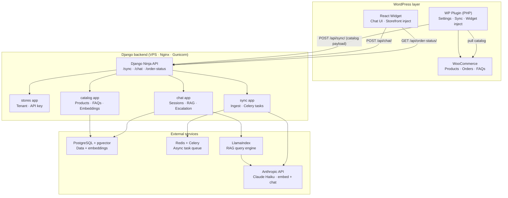
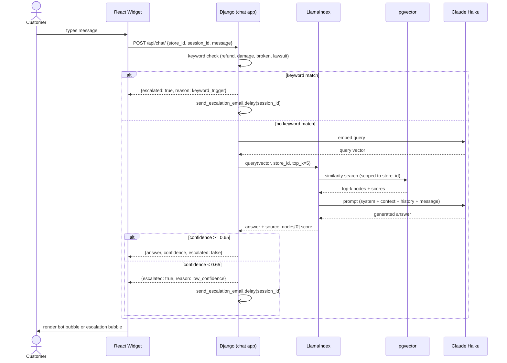
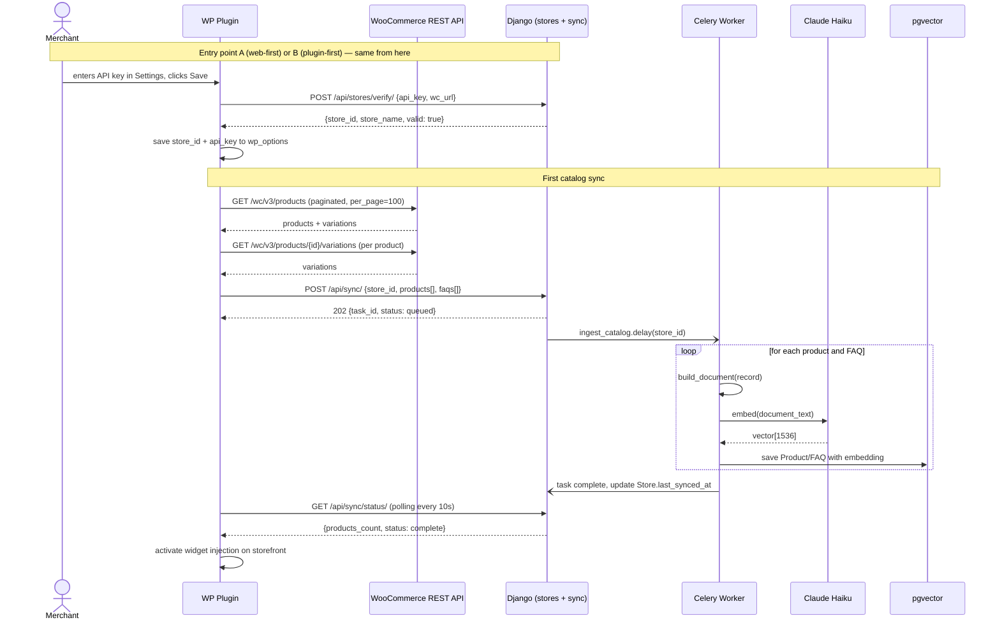
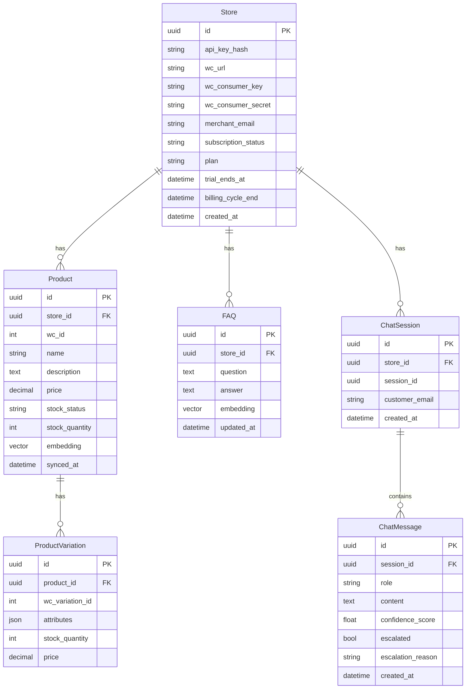
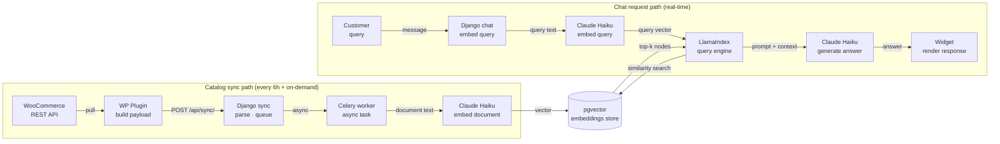

# WooCS.ai — PoC PRD

**Version:** 0.2 (PoC)
**Status:** Draft
**Scope:** Technical validation only — not production

---

## 1. Problem

WooCommerce merchants (SMB tier, <500 orders/day) handle repetitive support questions manually — product availability, stock, order status, return policy. No affordable, zero-setup solution exists that natively understands WooCommerce data without manual training.

---

## 2. Goal

Prove three technical hypotheses in 4 weeks:

| # | Hypothesis | Pass criteria |
|---|---|---|
| H1 | WooCommerce catalog can be synced reliably | 100+ products pulled and embedded in <3 min |
| H2 | RAG answers are accurate from store data | 15/20 manual queries answered correctly, no hallucination |
| H3 | Escalation to human is triggered correctly | Escalation fires when confidence < threshold; email delivered |

---

## 3. Non-goals (PoC)

- Merchant dashboard UI
- OAuth connect flow
- Billing / Polar.sh integration
- Multi-tenant isolation
- Analytics
- WP Marketplace submission
- Product card rendering in widget
- HITL feedback loop

---

## 4. Architecture overview

Three layers, all connected through a single API surface:

**WordPress layer** — WP plugin (PHP) is the bridge between the merchant's store and Django. It pulls catalog data from WooCommerce REST API, forwards it to Django, and injects the React widget into the storefront.

**Django backend** — all business logic lives here. Four apps: `stores` (tenant management), `sync` (catalog ingestion), `catalog` (products, FAQs, embeddings), `chat` (sessions, RAG, escalation). Exposed via Django Ninja API. Hosted on VPS with Nginx + Gunicorn.

**External services** — PostgreSQL + pgvector for data and vector storage, Redis + Celery for async task queue, Anthropic API (Claude Haiku) for both embeddings and chat generation, LlamaIndex as the RAG query engine layer.

The React widget sits on the storefront side, communicating directly with the Django Ninja API endpoints.

---

## 5. Components

### 5.1 WP Plugin (PHP)

**Responsibilities:**
- Pull catalog from WooCommerce REST API (products, variations, FAQs)
- POST catalog payload to Django `/api/sync/`
- Inject React widget JS bundle into storefront footer
- Admin settings page: API key, sync controls, widget toggle

**Sync strategy:** Pull (not webhook). Plugin initiates on-demand from settings page, or Django triggers via cron every 6 hours using stored WooCommerce credentials.

**Catalog payload fields per product:** id, name, description, price, stock_status, stock_quantity, variations (with attributes and per-variation stock), categories, tags. FAQs sent as question + answer pairs.

**Settings page injects into storefront:** `store_id`, `api_url`, `store_name` as global JS config consumed by the React widget.

---

### 5.2 Django Backend

#### Apps and responsibilities

**stores** — one record per merchant. Holds WooCommerce credentials, generated API key, merchant email. All other models are scoped to a Store via foreign key.

**sync** — exposes the ingest endpoint. On receiving a catalog payload, validates the API key, persists raw data to the catalog app models, and queues a Celery task to run the embedding pipeline.

**catalog** — stores Product, ProductVariation, and FAQ records. Each Product and FAQ holds a pgvector embedding field (1536 dimensions). The embedding pipeline runs as a Celery task: builds a text document from each record, calls Haiku embedding API, stores the resulting vector.

**chat** — handles all customer-facing interactions. Creates and manages ChatSession and ChatMessage records. On each incoming message: runs keyword check first, then embeds the query, retrieves top-k similar nodes from pgvector via LlamaIndex, builds the prompt, calls Haiku, evaluates the confidence score, and either returns an answer or triggers escalation.

#### Django Ninja endpoints

`POST /api/stores/register/` — creates Store record, returns generated api_key.

`POST /api/sync/` — accepts catalog payload, queues ingest task, returns task_id.

`GET /api/sync/status/` — returns products_count, faqs_count, last_synced_at, current status.

`POST /api/chat/` — accepts store_id, session_id, message. Returns answer, confidence score, escalated flag, escalation_reason.

`GET /api/order-status/` — accepts store_id, order_id. Calls WooCommerce REST API live, returns order status, line items, total. No caching — always fresh.

#### Confidence scoring and escalation

Confidence score = cosine similarity of the top-1 retrieved node from pgvector. Threshold: score below 0.65 triggers escalation.

Hardcoded keyword triggers (bypass RAG entirely): refund, damage, broken, lawsuit. Any match → immediate escalation signal, no LLM call made.

Escalation action: save ChatMessage with escalated=True and escalation_reason, then dispatch async Celery task to send email to Store.merchant_email containing full conversation transcript and a link to the session in Django Admin.

---

### 5.3 React widget (storefront)

Single JS bundle injected by the WP plugin. Reads store config from global JS object set by the plugin. Communicates with Django Ninja API for all chat and order queries — no direct WooCommerce calls from the widget.

Full component breakdown in Section 16.

---

## 6. Data models

### Store
One record per merchant. Central anchor for all other data.

| Field | Type | Notes |
|---|---|---|
| id | UUID | Primary key |
| api_key | string | Generated on registration, unique |
| wc_url | URL | Merchant's WooCommerce store URL |
| wc_consumer_key | string | WC REST API auth |
| wc_consumer_secret | string | WC REST API auth |
| merchant_email | email | Escalation email destination |
| created_at | datetime | |

### Product
One record per WooCommerce product, scoped to a Store.

| Field | Type | Notes |
|---|---|---|
| id | UUID | Primary key |
| store | FK → Store | |
| wc_id | integer | WC product ID |
| name | string | |
| description | text | |
| price | decimal | |
| stock_status | string | instock / outofstock / onbackorder |
| stock_quantity | integer | nullable |
| embedding | vector(1536) | pgvector field |
| synced_at | datetime | Last sync timestamp |

### ProductVariation
One record per variation (size, color, etc.), scoped to a Product.

| Field | Type | Notes |
|---|---|---|
| id | UUID | Primary key |
| product | FK → Product | |
| wc_variation_id | integer | |
| attributes | JSON | e.g. `{"size": "M", "color": "Navy"}` |
| stock_quantity | integer | nullable |
| price | decimal | |

### FAQ
Merchant-authored question/answer pairs. Embedded and indexed alongside products.

| Field | Type | Notes |
|---|---|---|
| id | UUID | Primary key |
| store | FK → Store | |
| question | text | |
| answer | text | |
| embedding | vector(1536) | pgvector field |
| updated_at | datetime | |

### ChatSession
One record per customer session. A session begins when the widget opens and ends when the tab closes (sessionStorage cleared).

| Field | Type | Notes |
|---|---|---|
| id | UUID | Primary key |
| store | FK → Store | |
| session_id | UUID | Generated client-side by widget |
| customer_email | email | nullable — not collected in PoC |
| created_at | datetime | |

### ChatMessage
One record per message in a session (both user and assistant turns).

| Field | Type | Notes |
|---|---|---|
| id | UUID | Primary key |
| session | FK → ChatSession | |
| role | string | user / assistant |
| content | text | |
| confidence_score | float | nullable — only set on assistant messages |
| escalated | boolean | default false |
| escalation_reason | string | low_confidence / keyword_trigger / customer_request |
| created_at | datetime | |

---

## 7. Prompt template

System prompt sent to Claude Haiku on every chat turn:

```
You are a customer support assistant for {store_name}.
Answer questions using ONLY the context below.
If the answer is not in the context, say you will connect the customer with the team.
Never invent product details, prices, or stock levels.

CONTEXT:
{retrieved_chunks}

ORDER STATUS (if queried):
{order_data}

CONVERSATION HISTORY:
{last_5_messages}

CUSTOMER: {user_message}
ASSISTANT:
```

---

## 8. Tech stack

| Layer | Choice | Reason |
|---|---|---|
| WP plugin | PHP 8.1 | WP requirement |
| Widget | React (bundled) | Component-based, storefront-injectable |
| Backend | Django 5.x + Django Ninja | Async-ready, type-safe API schema |
| Task queue | Celery + Redis | Async catalog ingest |
| Database | PostgreSQL 15 + pgvector | Single DB for data + embeddings |
| RAG framework | LlamaIndex | Query engine, node retrieval, metadata filtering |
| Embeddings | Claude Haiku (Anthropic SDK) | Single vendor for embed + chat |
| LLM | Claude Haiku (via LlamaIndex Anthropic) | Cost-efficient, sufficient quality for support RAG |
| Hosting | VPS — Ubuntu + Nginx + Gunicorn | Full control, no platform lock-in |
| Email | Django SMTP (Gmail) | Zero cost for PoC |

---

## 9. Kill switches

Stop PoC if any of these are hit:

| Signal | Threshold | Action |
|---|---|---|
| RAG accuracy | <60% on 20-query test set | Re-evaluate chunking strategy |
| Chat latency | p95 > 5s | Add response caching layer |
| Widget theme conflict | >3 popular WP themes broken | Rebuild widget with Shadow DOM isolation |
| WC API rate limit | Sync fails consistently | Switch to webhook push model |

---

## 10. Test plan (Week 4)

**Manual query set — 20 queries:**

| Category | Count | Examples |
|---|---|---|
| Product availability | 6 | "Do you have X in size M?", "Is Y in stock?" |
| Product info | 4 | "What material is X?", "What sizes does Y come in?" |
| Order status | 4 | "Where is my order #1234?", "When will #5678 arrive?" |
| FAQ / policy | 4 | "What's your return policy?", "How long is shipping?" |
| Out-of-scope | 2 | "Can you write me a poem?", "What's the weather?" |

**Pass criteria:**
- Product queries: answer matches WC data exactly, no invented price or stock
- Order queries: status matches live WC order record
- FAQ queries: answer sourced from FAQ entries, not hallucinated
- Out-of-scope: graceful decline or escalation — never a fabricated answer

**Escalation test:**
- 5 queries with keywords (refund, damage) → all 5 must trigger escalation
- 5 queries on topics not in catalog → at least 4 must escalate
- Escalation email delivered to merchant inbox within 60 seconds

---

## 11. Deliverables

- [ ] WP plugin installable via zip upload
- [ ] Django backend live on VPS
- [ ] React widget renders and chats on test WC store
- [ ] 20-query test results documented
- [ ] Escalation email confirmed working
- [ ] PoC findings doc: what passed, what failed, recommended next steps

---

## 12. Screen inventory & feature map

### Layer A — WP Admin Dashboard (plugin pages)

#### A1. Settings page
**Route:** `/wp-admin/admin.php?page=woocs-settings`

**Features:**
- Connection status indicator (connected / not connected / error)
- API key display: masked with copy button
- WooCommerce credentials: store URL, consumer key, consumer secret
- Merchant email field
- Widget toggle: enable/disable on storefront
- Widget position: bottom-right / bottom-left
- Save button — on save, registers store with Django and stores returned api_key

**Integration:** On save → `POST /api/stores/register/` → Django returns api_key → stored in wp_options.

**States:** Not connected (show connect CTA) · Connected (show API key + sync summary) · Connection error (show retry).

---

#### A2. Sync status page
**Route:** `/wp-admin/admin.php?page=woocs-sync`

**Features:**
- Sync summary: products count, FAQs count, last synced timestamp
- Per-entity status rows: Products / Variations / FAQs / Orders API
- Status indicators: synced · syncing · error · pending
- Manual sync button — triggers immediate catalog pull and POST to Django
- Sync log: last 10 events with timestamp, entity, count, status
- Error detail expandable per failed item

**Integration:** Page load → `GET /api/sync/status/` · Manual sync → plugin pulls WC API → `POST /api/sync/` · Auto-refresh every 10s while status is syncing.

---

#### A3. FAQ manager page
**Route:** `/wp-admin/admin.php?page=woocs-faqs`

**Features:**
- FAQ list table: question, answer preview, last updated
- Add FAQ form: question + answer textarea
- Edit inline: click row to edit in place
- Delete with confirm dialog
- "Sync FAQs now" button — sends FAQs-only payload to Django

**Integration:** FAQs stored in custom WP table. Sync button → `POST /api/sync/` with FAQs payload only → Django re-embeds updated entries via Celery.

---

#### A4. Widget preview page
**Route:** `/wp-admin/admin.php?page=woocs-preview`

**Features:**
- Iframe: storefront with widget visible
- Live chat test: send message, see real bot response
- Debug overlay (PoC only): confidence score per response
- Escalation test button: sends "refund" keyword, verifies trigger
- Response latency display in ms

**Integration:** All chat in iframe goes through live `/api/chat/` endpoint.

---

### Layer B — Storefront (customer-facing)

#### B1. Chat widget — all storefront pages
Injected via plugin using `wp_enqueue_script()`. Config passed via `window.WooCS = {store_id, api_url, store_name}`.

Full state flow and component definitions in Section 16.

**Pages widget appears on:** All public-facing pages (global injection). Excluded by default: WP Admin, order confirmation page.

**Integration:** All chat → `POST /api/chat/` · Order lookup → `GET /api/order-status/` · No direct WooCommerce calls from widget.

---

### Layer C — Django (internal only, no merchant UI in PoC)

#### C1. Django Admin — Stores
Internal operator use only.

**Features:**
- Store list: id, wc_url, merchant_email, created_at
- Store detail: all fields, inline sync history
- Regenerate API key action
- Force sync action → triggers Celery ingest task
- Deactivate store

#### C2. Django Admin — Catalog
**Features:**
- Product list with filters: store, stock_status
- Product detail: all fields, embedding status
- Variation inline list under each product
- FAQ list: question, answer, store, synced_at

#### C3. Django Admin — Chat
**Features:**
- Session list: store, created_at, message count, escalated flag
- Session detail: full message thread with role, content, confidence score, escalation_reason
- Filter by store, by escalated=True
- Primary PoC debug tool: verify answers, spot hallucinations, check escalation triggers

---

## 13. Integration flows

### Flow 1 — Store registration and first sync

Merchant installs plugin from WP Admin. On the Settings page, merchant enters WooCommerce consumer key and secret and clicks Save. The plugin calls `POST /api/stores/register/` with the store URL, credentials, and merchant email. Django creates a Store record, generates an api_key, and returns it. The plugin saves the api_key to wp_options.

The plugin then immediately initiates a first sync: it calls the WooCommerce REST API (paginated, 100 products per page) to pull all products and their variations. It packages this into a catalog payload and calls `POST /api/sync/`. Django returns a 202 with a task_id. Celery picks up the ingest task and runs the embedding pipeline: for each product and FAQ, it builds a text document, calls Haiku embedding API, and saves the vector to pgvector.

The Sync status page polls `GET /api/sync/status/` every 10 seconds and shows live progress. Once complete, the widget is active on the storefront.

---

### Flow 2 — Customer chat (RAG path)

Customer opens the widget. The widget generates a UUID session_id and stores it in sessionStorage. Customer types a message. Widget calls `POST /api/chat/` with store_id, session_id, and message.

Django creates or retrieves the ChatSession. It appends a ChatMessage for the user turn. It then runs a keyword scan — if a hardcoded keyword is found, it skips directly to escalation (Flow 4). If no keyword match, it calls Haiku to embed the query, then runs a pgvector similarity search scoped to the store_id, retrieving the top-5 most similar nodes.

LlamaIndex builds the prompt using the retrieved context, the last 5 messages, and the system prompt template. It calls Haiku and receives the generated answer. Django evaluates the confidence score (top-1 node similarity). If score is 0.65 or above, it saves the assistant ChatMessage and returns the answer. If below 0.65, it saves the message as escalated and triggers escalation (Flow 4).

Widget receives the response JSON and renders either a bot bubble or an escalation bubble.

---

### Flow 3 — Order status lookup

Customer types a message containing an order number (pattern: `#\d+` or "order \d+"). Django's chat view detects the pattern before running RAG. It calls the WooCommerce REST API directly using the store's stored credentials: `GET /wp-json/wc/v3/orders/{id}`. WooCommerce returns the order record.

Django maps the WC status to a customer-facing label (e.g. "processing" → "Processing your order") and builds a plain-text answer including order number, status, line item names, and total. No RAG or embedding is involved. Confidence score is set to 1.0. The answer is returned to the widget.

---

### Flow 4 — Escalation

Triggered by either a keyword match (pre-RAG) or a low confidence score (post-RAG). Django saves the ChatMessage with escalated=True and the appropriate escalation_reason (keyword_trigger or low_confidence). It dispatches an async Celery task: send email to Store.merchant_email with subject "Support escalation — {store name}", body containing the conversation transcript, and a link to the ChatSession in Django Admin.

The widget receives escalated=true in the response JSON and renders the escalation bubble (amber background, two CTAs). If the customer taps "Talk to someone", the widget sends a confirmation message and the session is marked as handed off. If the customer taps "No thanks", the bubble is dismissed and the chat continues normally.

---

### Flow 5 — Periodic re-sync

Celery beat runs every 6 hours. It fetches all active Store records and for each store calls the WooCommerce REST API with a `modified_after` filter set to `last_synced_at`. If any products have changed, it sends a partial sync payload to Django (changed products only). Django re-embeds only the changed records and updates `synced_at`. The Sync status page reflects the updated timestamp on next load.

---

### LlamaIndex + pgvector integration

LlamaIndex is used as the query engine layer. During catalog ingest, each product and FAQ is represented as a LlamaIndex Document node with metadata including store_id. These nodes are embedded via the Haiku embedding API and stored in pgvector using LlamaIndex's PGVectorStore integration.

At query time, the chat view builds a LlamaIndex query engine scoped to the current store_id via metadata filtering. It runs the customer's embedded query through the engine, retrieving the top-5 similar nodes. The query engine builds the final prompt, calls Haiku for generation, and returns both the answer text and the source node similarity scores (used for confidence evaluation).

---

## 14. Mock UX (ASCII wireframes)

### A1. WP Admin — Settings

```
┌─────────────────────────────────────────────────────────────────┐
│ WP Admin Sidebar │ WooCS.ai › Settings                         │
├──────────────────┼──────────────────────────────────────────────┤
│  Dashboard       │  ┌─ Connection ───────────────────────────┐  │
│  Posts           │  │  Status      [● Connected]             │  │
│  WooCommerce     │  │  Store ID    xxxxxxxx-xxxx-xxxx        │  │
│  ───────────     │  │  API Key     ••••••••••••  [Copy]      │  │
│  WooCS.ai     ◀  │  └────────────────────────────────────────┘  │
│   Settings       │                                              │
│   Sync           │  ┌─ WooCommerce credentials ──────────────┐  │
│   FAQs           │  │  Store URL   [https://yourstore.com  ] │  │
│   Preview        │  │  Consumer K  [ck_xxxxxxxxxxxxxxxxxx  ] │  │
│                  │  │  Consumer S  [cs_xxxxxxxxxxxxxxxxxx  ] │  │
│                  │  │  Email       [you@yourstore.com      ] │  │
│                  │  └────────────────────────────────────────┘  │
│                  │                                              │
│                  │  ┌─ Widget ───────────────────────────────┐  │
│                  │  │  Enable widget   [x] On storefront     │  │
│                  │  │  Position        ( ) Bottom-right      │  │
│                  │  │                  ( ) Bottom-left       │  │
│                  │  └────────────────────────────────────────┘  │
│                  │                                              │
│                  │  [Save settings]   [Disconnect store]        │
└──────────────────┴──────────────────────────────────────────────┘
```

---

### A2. WP Admin — Sync status

```
┌─────────────────────────────────────────────────────────────────┐
│ WP Admin Sidebar │ WooCS.ai › Sync status                      │
├──────────────────┼──────────────────────────────────────────────┤
│  WooCS.ai        │  ┌─ Sync summary ─────────────────────────┐  │
│   Settings       │  │  Products    248   ✓ synced            │  │
│   Sync        ◀  │  │  Variations  1024  ✓ synced            │  │
│   FAQs           │  │  FAQs        34    ✓ synced            │  │
│   Preview        │  │  Orders API        ✓ live              │  │
│                  │  │  Last sync   2 minutes ago             │  │
│                  │  │              [Sync now]                │  │
│                  │  └────────────────────────────────────────┘  │
│                  │                                              │
│                  │  ┌─ Sync log ─────────────────────────────┐  │
│                  │  │  14:02  Products     248 synced   ✓    │  │
│                  │  │  14:02  Variations  1024 synced   ✓    │  │
│                  │  │  14:01  FAQs          34 synced   ✓    │  │
│                  │  │  02:00  Products       1 failed   ✗    │  │
│                  │  │         └─ ID #412: missing data       │  │
│                  │  └────────────────────────────────────────┘  │
└──────────────────┴──────────────────────────────────────────────┘
```

---

### A3. WP Admin — FAQ manager

```
┌─────────────────────────────────────────────────────────────────┐
│ WP Admin Sidebar │ WooCS.ai › FAQs                 [+ Add FAQ] │
├──────────────────┼──────────────────────────────────────────────┤
│  WooCS.ai        │  ┌─ Add FAQ ──────────────────────────────┐  │
│   Settings       │  │  Question  [What is your return poli ] │  │
│   Sync           │  │  Answer    [We accept returns within ] │  │
│   FAQs        ◀  │  │            [30 days of purchase...   ] │  │
│   Preview        │  │            [Save FAQ]  [Cancel]        │  │
│                  │  └────────────────────────────────────────┘  │
│                  │                                              │
│                  │  ┌─ FAQ list (34) ────────────────────────┐  │
│                  │  │  # │ Question              │ Updated   │  │
│                  │  │  1 │ What is your return.. │ 2d  [✎][✗]│  │
│                  │  │  2 │ How long is shipping? │ 5d  [✎][✗]│  │
│                  │  │  3 │ Do you ship overseas? │ 1w  [✎][✗]│  │
│                  │  │              [Sync FAQs now]            │  │
│                  │  └────────────────────────────────────────┘  │
└──────────────────┴──────────────────────────────────────────────┘
```

---

### A4. WP Admin — Widget preview

```
┌─────────────────────────────────────────────────────────────────┐
│ WP Admin Sidebar │ WooCS.ai › Widget preview                   │
├──────────────────┼──────────────────────────────────────────────┤
│  WooCS.ai        │  [Test escalation]  [Clear session]          │
│   Settings       │                                              │
│   Sync           │  ┌─ Storefront preview ───────────────────┐  │
│   FAQs           │  │  ┌── Store header ──────────────────┐  │  │
│   Preview     ◀  │  │  │  Sunrise Apparel    🛒  ☰        │  │  │
│                  │  │  └──────────────────────────────────┘  │  │
│                  │  │                                        │  │
│                  │  │  [product grid .....................]   │  │
│                  │  │                                        │  │
│                  │  │                    ┌────────────────┐  │  │
│                  │  │                    │ 🤖 Store asst  │  │  │
│                  │  │  ┌─────────────┐   │ ● Online    [×]│  │  │
│                  │  │  │ conf: 0.87  │   │ Hi! I can help │  │  │
│                  │  │  │ (debug PoC) │   │ [Ask now...]   │  │  │
│                  │  │  └─────────────┘   └────────────────┘  │  │
│                  │  └────────────────────────────────────────┘  │
│                  │  Last response: 1.24s  Confidence: 0.87      │
└──────────────────┴──────────────────────────────────────────────┘
```

---

### B1. Storefront — widget collapsed

```
┌─────────────────────────────────────────────────────────────┐
│  ┌── Store header ───────────────────────────────────────┐  │
│  │  Sunrise Apparel                           🛒  ☰     │  │
│  └───────────────────────────────────────────────────────┘  │
│                                                             │
│  [product grid]                                             │
│  [product grid]                                             │
│                                                             │
│  [footer]                                            [💬]  │
└─────────────────────────────────────────────────────────────┘
                                                      ↑
                                               C-01 Bubble launcher
```

---

### B2. Storefront — widget open, idle

```
│                               ┌────────────────────────┐  │
│                               │ C-02 ─────────────────  │  │
│                               │ 🤖 Store assistant  [×] │  │
│                               │ ● Online                │  │
│                               │─────────────────────────│  │
│                               │ C-03 Message thread     │  │
│                               │                         │  │
│                               │  Hi! I can help you     │  │
│                               │  find products, check   │  │
│                               │  stock, or track your   │  │
│                               │  order.                 │  │
│                               │                         │  │
│                               │ C-04 Quick replies      │  │
│                               │ [Check order] [Returns] │  │
│                               │                         │  │
│                               │ C-09 ─────────────────  │  │
│                               │ [Ask anything...     ] >│  │
│                               │─────────────────────────│  │
│                               │ C-10 Powered by WooCS.ai│  │
│                               └────────────────────────┘  │
```

---

### B3. Storefront — mid-conversation with product result

```
│                               ┌────────────────────────┐  │
│                               │ 🤖 Store assistant  [×] │  │
│                               │─────────────────────────│  │
│                               │                         │  │
│                      user →   │  Do you have the blue   │  │
│                               │  hoodie in size M?      │  │
│                               │                         │  │
│   bot →                       │  Yes! Here's what I     │  │
│                               │  found:                 │  │
│                               │  C-05 ───────────────   │  │
│                               │  [product image]        │  │
│                               │  Classic Hoodie         │  │
│                               │  Navy Blue · Size M     │  │
│                               │  $34.99   In stock (5)  │  │
│                               │  [View product]         │  │
│                               │  ────────────────────   │  │
│                               │                         │  │
│                               │ [Other sizes] [Returns] │  │
│                               │ [Ask anything...     ] >│  │
│                               └────────────────────────┘  │
```

---

### B4. Storefront — escalation state

```
│                               ┌────────────────────────┐  │
│                               │ 🤖 Store assistant  [×] │  │
│                               │─────────────────────────│  │
│                      user →   │  I received a damaged   │  │
│                               │  item and want a refund │  │
│                               │                         │  │
│   C-07 escalation bubble →    │ ┌─ amber background ──┐ │  │
│                               │ │ ⚠ I'm not sure about│ │  │
│                               │ │ this. Want me to     │ │  │
│                               │ │ connect you with the │ │  │
│                               │ │ team?                │ │  │
│                               │ │                      │ │  │
│                               │ │ [Talk to someone]    │ │  │
│                               │ │ [No thanks]          │ │  │
│                               │ └────────────────────┘ │  │
│                               │                         │  │
│                               │ [Ask anything...     ] >│  │
│                               └────────────────────────┘  │
```

---

### B5. Storefront — order status result

```
│                               ┌────────────────────────┐  │
│                               │ 🤖 Store assistant  [×] │  │
│                               │─────────────────────────│  │
│                      user →   │  Where is my order      │  │
│                               │  #4821?                 │  │
│                               │                         │  │
│   C-06 order card →           │  Order #4821            │  │
│                               │  ─────────────────────  │  │
│                               │  Status:  Processing    │  │
│                               │  Items:   Hoodie ×1     │  │
│                               │           Slim Jeans ×1 │  │
│                               │  Total:   $89.98        │  │
│                               │                         │  │
│                               │ [Track again] [Help]    │  │
│                               │ [Ask anything...     ] >│  │
│                               └────────────────────────┘  │
```

---

### C1. Django Admin — Chat session detail (PoC debug view)

```
┌─────────────────────────────────────────────────────────────────┐
│ Django Admin │ Chat › Sessions › xxxxxxxx-xxxx                  │
├──────────────┴─────────────────────────────────────────────────┤
│  Store:       Sunrise Apparel                                   │
│  Session ID:  xxxxxxxx-xxxx-xxxx-xxxx-xxxxxxxxxxxx              │
│  Created:     2025-06-26 14:02:11                               │
│  Escalated:   Yes                                               │
│                                                                 │
│  ┌─ Messages ──────────────────────────────────────────────┐    │
│  │  [user]  14:02:11  Do you have blue hoodie in size M?   │    │
│  │                                                         │    │
│  │  [asst]  14:02:12  Yes! Classic Hoodie, Navy Blue...    │    │
│  │          conf: 0.87   escalated: No                     │    │
│  │                                                         │    │
│  │  [user]  14:03:44  I got a damaged item, want refund    │    │
│  │                                                         │    │
│  │  [asst]  14:03:45  [escalated — no answer generated]    │    │
│  │          conf: 0.00   escalated: Yes                    │    │
│  │          reason: keyword_trigger                        │    │
│  └─────────────────────────────────────────────────────────┘    │
│                                                                 │
│  [← Back to sessions]                                          │
└─────────────────────────────────────────────────────────────────┘
```

---

## 15. Storefront widget — component definitions

Widget starts as a floating bubble (C-01). Click expands to full chat panel. All components live inside the panel.

### Widget state machine

```
[C-01 Bubble] → click → [Panel: Idle]
                              ↓ customer types
                         [Panel: Chatting]
                              ↓ product query matched
                         [Panel: Product result — C-05 visible]
                              ↓ order number detected
                         [Panel: Order status — C-06 visible]
                              ↓ confidence < 0.65 or keyword match
                         [Panel: Escalated — C-07 visible]
```

---

### C-01 · Bubble launcher

Always visible on storefront. Fixed position, bottom-right corner (configurable).

**Contains:** Chat icon (when closed) · X icon (when panel open) · Unread badge (post-PoC)

**Behavior:** Click → open panel · Click again → collapse to bubble · Position configurable from A1 Settings.

---

### C-02 · Panel header

Top bar of expanded panel. Always visible when panel is open.

**Contains:** Bot avatar icon · Bot name (default: "Store assistant", configurable) · Online status indicator · Close button → collapses to bubble.

---

### C-03 · Message thread

Scrollable conversation area. Grows as messages accumulate. Auto-scrolls to latest message.

**Contains:** Bot message bubbles (left-aligned) · User message bubbles (right-aligned) · C-05 Product card (conditional, inside bot bubble) · C-06 Order status card (conditional, inside bot bubble) · C-07 Escalation bubble (conditional, inside bot bubble) · C-08 Typing indicator (conditional)

---

### C-04 · Quick replies bar

Contextual pill buttons below the latest bot message. Disappears once customer starts typing.

**Contains:** 2–3 pill buttons, context-driven · Tapping a pill sends it as a user message

| Context | Pills shown |
|---|---|
| Idle / greeting | Check my order · Return policy · Browse products |
| After product answer | Other sizes · View product |
| After order status | Track again · Need help? |
| After escalation dismissed | Ask another question |

---

### C-05 · Product card

Rendered inline inside a bot bubble when a product query is matched.

**Contains:**
- Product image (from WC sync; fallback to category icon if missing)
- Product name
- Matched variation: only the attributes relevant to the query (e.g. Size: M · Color: Navy Blue)
- Price — never shown as $0; omit if missing
- Stock status badge:
  - In stock → green
  - Low stock (n left) → amber, shows exact count
  - Out of stock → red; bot suggests nearest available alternative if one exists in catalog
- "View product" CTA → opens WC product page in same tab

**Rules:** One card per bot message in PoC. Stock count hidden if merchant has disabled it in WooCommerce settings.

---

### C-06 · Order status card

Rendered inline when customer queries an order number.

**Contains:** Order number · Status (mapped from WC) · Line item names (no SKUs) · Order total

**WC status → customer label mapping:**

| WC status | Customer-facing label |
|---|---|
| pending | Payment pending |
| processing | Processing your order |
| on-hold | On hold |
| completed | Delivered |
| cancelled | Cancelled |
| refunded | Refunded |
| failed | Payment failed |

**Rules:** Order not found → "I couldn't find that order. Please check your order number." No shipping address shown (privacy). No cross-store order lookup.

---

### C-07 · Escalation bubble

Replaces a normal bot response when confidence is below threshold or a keyword is detected. Amber background — visually distinct from bot bubbles.

**Contains:** Warning icon · Fixed escalation message (not AI-generated) · Two CTAs: "Talk to someone" and "No thanks"

**"Talk to someone" flow:** Records escalation in ChatMessage · Dispatches email to merchant · Shows confirmation: "Got it! The team will reach out to you shortly."

**"No thanks" flow:** Dismisses the bubble · Chat continues normally

**Rules:** Customer must choose one CTA — bubble is not dismissible by scrolling. Only one escalation bubble per session. Subsequent low-confidence turns show a softer inline fallback: "I'm not sure — try rephrasing."

---

### C-08 · Typing indicator

Three animated dots shown in the message thread while awaiting Django response.

**Rules:** Appears immediately after message is sent. Disappears when response arrives. After 8 seconds, replaced with "Still looking…" text.

---

### C-09 · Input bar

Pinned to bottom of panel at all times.

**Contains:** Text input · Send button (disabled when input is empty) · Input disabled while awaiting response to prevent double-send

**Placeholder by context:**

| Context | Placeholder text |
|---|---|
| Idle | Ask anything about our store… |
| After product answer | Want to know about other products? |
| After order status | Any other questions? |
| Escalation visible | Continue chatting… |

---

### C-10 · Panel footer

Minimal branding line, always visible at panel bottom.

**Contains:** "Powered by WooCS.ai" — links to woocs.ai, opens in new tab. Removed in future white-label tier.

---

### Component hierarchy

```
Widget
├── C-01  Bubble launcher
└── Panel (when open)
    ├── C-02  Panel header
    ├── C-03  Message thread
    │   ├── Bot message bubble
    │   │   ├── C-05  Product card (if product query)
    │   │   ├── C-06  Order status card (if order query)
    │   │   └── C-07  Escalation bubble (if low confidence or keyword)
    │   ├── User message bubble
    │   └── C-08  Typing indicator (while awaiting response)
    ├── C-04  Quick replies bar (after each bot message)
    ├── C-09  Input bar
    └── C-10  Panel footer
```

---

### Component states summary

| Component | Default | Loading | Error | Empty |
|---|---|---|---|---|
| C-01 Bubble | Icon visible | — | — | — |
| C-03 Thread | Greeting message | — | — | Greeting only |
| C-04 Quick replies | 3 pills | — | — | Hidden |
| C-05 Product card | Full card | Skeleton | "Not found" inline | — |
| C-06 Order card | Full card | Skeleton | "Order not found" inline | — |
| C-07 Escalation | Amber bubble | — | — | — |
| C-08 Typing | Animated dots | — | "Still looking…" after 8s | — |
| C-09 Input | Enabled | Disabled | Disabled | Send btn disabled |


---

## 16. Auth model

### Overview

All communication between the WP plugin and Django is authenticated via a single static API key. The key is generated by Django at store registration and never changes unless explicitly rotated by the operator. There are no sessions, no cookies, no JWTs. Every request from the plugin carries the key in the HTTP header.

This applies to all plugin-to-Django calls: sync, chat, order status, and sync status checks.

The React widget on the storefront does **not** use the API key. It uses `store_id` only — a non-secret UUID that identifies which store's catalog to query. The API key is never exposed to the browser.

---

### API key lifecycle

**Generation** — Django generates a cryptographically random 48-character key (hex) when a Store record is created, either via web signup or plugin-initiated registration. The key is stored hashed in the database (SHA-256). The raw key is shown once at generation time and never again.

**Transmission** — plugin stores the raw key in `wp_options` (WordPress encrypted options table). Every outbound request to Django includes the header: `X-API-Key: {raw_key}`.

**Validation** — Django middleware hashes the incoming key and compares against the stored hash for that store. If no match, return 401. If match, attach the Store object to the request context for the view to use.

**Rotation** — operator-only action via Django Admin. Generates a new key, invalidates the old one immediately. Merchant must update the key in A1 Settings manually after rotation. In PoC, rotation is not exposed to merchants.

**Expiry** — no automatic expiry in PoC. Post-PoC: keys tied to subscription status. If subscription lapses, key is suspended (returns 402) not deleted — reactivating the subscription restores access without requiring re-setup.

---

### What each key grants

| Endpoint | Requires key | Notes |
|---|---|---|
| `POST /api/stores/register/` | No | Public — creates the key |
| `POST /api/sync/` | Yes | Scoped to requesting store only |
| `GET /api/sync/status/` | Yes | Scoped to requesting store only |
| `POST /api/chat/` | No — uses store_id | Widget-facing, public but store-scoped |
| `GET /api/order-status/` | No — uses store_id | Widget-facing, public but store-scoped |

The chat and order endpoints are intentionally keyless — the widget runs in the browser and cannot hold secrets. They are rate-limited by store_id instead (post-PoC).

---

### Cross-system identity

The link between the WP plugin and Django is the `store_id` + `api_key` pair:

```
WordPress side          Django side
─────────────────       ──────────────────────────────
wp_options:             Store record:
  woocs_store_id   ←→    id (UUID)
  woocs_api_key    ←→    api_key_hash (SHA-256)
  woocs_api_url    ←→    (where to send requests)
```

There is no "merchant user account" in Django in PoC. The Store record IS the identity. Post-PoC, a `MerchantUser` model would be added and linked to Store for dashboard login.

---

## 17. Onboarding flows

Two entry points, same end state: plugin installed, store connected, catalog synced, widget live.

---

### Entry point A — Web-first

Merchant discovers WooCS.ai via marketing site, search, or word of mouth before installing the plugin.

```
1. Merchant visits woocs.ai
2. Clicks "Start free trial"
3. Fills signup form:
     - Email
     - Password
     - Store URL (e.g. https://mystore.com)
4. Django creates MerchantUser + Store record, generates api_key
5. Onboarding screen shown:
     "Your API key is ready. Install the plugin next."
     [Copy API key]  [Download plugin]  [View WP.org listing]
6. Merchant installs plugin in WP Admin
7. Opens WooCS.ai › Settings in WP Admin
8. Pastes API key into the API key field
9. Clicks Save → plugin calls POST /api/stores/verify/
     Django confirms key is valid, returns store_id + store name
10. Plugin saves store_id + api_key to wp_options
11. Plugin immediately initiates first catalog sync
12. Sync status page shows progress
13. Widget activates on storefront
```

**Screen shown at step 5 (post-signup web page):**

```
┌─────────────────────────────────────────────────────────┐
│  WooCS.ai                                    [Dashboard] │
├─────────────────────────────────────────────────────────┤
│                                                         │
│   You're almost live.                                   │
│                                                         │
│   ┌─ Step 1: Copy your API key ─────────────────────┐   │
│   │  ••••••••••••••••••••••••  [Copy]  [Show]       │   │
│   │  Keep this safe — it won't be shown again.      │   │
│   └─────────────────────────────────────────────────┘   │
│                                                         │
│   ┌─ Step 2: Install the plugin ────────────────────┐   │
│   │  [Download plugin .zip]                         │   │
│   │  or search "WooCS.ai" in WP Admin › Plugins     │   │
│   └─────────────────────────────────────────────────┘   │
│                                                         │
│   ┌─ Step 3: Paste key in plugin settings ──────────┐   │
│   │  WP Admin › WooCS.ai › Settings › API key field │   │
│   └─────────────────────────────────────────────────┘   │
│                                                         │
│   [I've done this — check my connection]                │
│                                                         │
└─────────────────────────────────────────────────────────┘
```

---

### Entry point B — Plugin-first

Merchant finds the plugin on WP.org or WooCommerce marketplace and installs it before visiting the website.

```
1. Merchant installs WooCS.ai plugin from WP.org / WP Admin
2. Activates plugin
3. WP Admin sidebar shows WooCS.ai › Settings
4. Settings page shows "Not connected" state:
     "Connect your store to WooCS.ai to get started."
     [Connect to WooCS.ai]
5. Merchant clicks Connect
6. Plugin opens woocs.ai/connect in a new tab, passing:
     ?store_url=https://mystore.com&redirect=wp-admin
7. Merchant signs up or logs in on woocs.ai
8. woocs.ai generates api_key, shows it with copy prompt
9. Merchant copies key, returns to WP Admin tab
10. Pastes key into API key field in Settings page
11. Clicks Save → same flow as Web-first step 9 onwards
```

**Settings page — not connected state (step 4):**

```
┌─────────────────────────────────────────────────────────┐
│ WooCS.ai › Settings                                     │
├─────────────────────────────────────────────────────────┤
│                                                         │
│  ┌─ Connection ──────────────────────────────────────┐  │
│  │                                                   │  │
│  │  Status    ○ Not connected                        │  │
│  │                                                   │  │
│  │  Connect your store to start automating support.  │  │
│  │  Free 14-day trial — no credit card required.     │  │
│  │                                                   │  │
│  │  [Connect to WooCS.ai]                            │  │
│  │                                                   │  │
│  │  Already have an API key?                         │  │
│  │  [Enter key manually ▾]                           │  │
│  │    API Key  [________________________]            │  │
│  │             [Connect]                             │  │
│  │                                                   │  │
│  └───────────────────────────────────────────────────┘  │
│                                                         │
└─────────────────────────────────────────────────────────┘
```

---

### Shared end state (both entry points)

After the API key is verified and saved, the plugin runs first sync automatically. The merchant sees the Sync status page with live progress. Once sync completes, the widget is active.

The Settings page transitions to the connected state (as shown in Section 14 A1 mock).

**First-time sync completion screen:**

```
┌─────────────────────────────────────────────────────────┐
│ WooCS.ai › Sync status                                  │
├─────────────────────────────────────────────────────────┤
│                                                         │
│  ✓  Your store is live!                                 │
│                                                         │
│  ┌────────────────────────────────────────────────┐     │
│  │  Products    248   ✓ synced                    │     │
│  │  Variations  1024  ✓ synced                    │     │
│  │  FAQs        0     — none found (add some?)    │     │
│  │  Orders API        ✓ live                      │     │
│  └────────────────────────────────────────────────┘     │
│                                                         │
│  Your chat widget is now active on your storefront.     │
│                                                         │
│  [Preview widget]   [Add FAQs]   [View dashboard]       │
│                                                         │
└─────────────────────────────────────────────────────────┘
```

---

### Onboarding checklist (internal — shown in web dashboard post-PoC)

| Step | Trigger | Done state |
|---|---|---|
| Account created | Signup complete | ✓ |
| Plugin installed | First `POST /api/stores/verify/` received | ✓ |
| First sync complete | Celery task ingest_catalog finished | ✓ |
| FAQ added | At least 1 FAQ record exists for store | ✓ |
| First chat received | First ChatMessage with role=user exists | ✓ |

---

## 18. Subscription & billing

### Trial

- 14 days from account creation date, no credit card required
- Full access to all PoC features during trial
- Trial state stored on Store record: `trial_ends_at` datetime field
- Django middleware checks trial status on every API key-authenticated request
- 3 days before trial end: email reminder sent to merchant_email
- 1 day before: second reminder with pricing and payment link
- On trial end: Store suspended — API key returns 402 with body `{"error": "trial_expired", "upgrade_url": "https://woocs.ai/billing"}`

---

### Plans (post-PoC, via Polar.sh)

| Plan | Price | Conversation limit |
|---|---|---|
| Starter | $19/month | 500 conversations |
| Growth | $49/month | 2,000 conversations |
| Pro | $99/month | 6,000 conversations |

Overage: $0.02 per conversation above plan limit. Soft cap — service continues, merchant notified by email.

---

### Polar.sh integration

Polar.sh acts as Merchant of Record. Handles payment processing, invoicing, and tax compliance globally.

**Webhook events Django listens to:**

| Event | Action |
|---|---|
| `subscription.created` | Set Store.subscription_status = active, Store.plan = plan_id, Store.billing_cycle_end = date |
| `subscription.updated` | Update plan and billing_cycle_end |
| `subscription.cancelled` | Set subscription_status = cancelled, suspend at billing_cycle_end |
| `subscription.expired` | Set subscription_status = expired, suspend API key immediately |
| `payment.failed` | Email merchant, grace period 3 days before suspension |

**Store subscription fields:**

| Field | Type | Notes |
|---|---|---|
| subscription_status | string | trial / active / cancelled / expired / suspended |
| plan | string | starter / growth / pro / null |
| trial_ends_at | datetime | Set at account creation |
| billing_cycle_end | datetime | Updated on each Polar webhook |
| conversation_count | integer | Reset monthly, incremented per ChatSession |

---

### Plugin behaviour by subscription state

| State | Plugin behaviour | Widget behaviour |
|---|---|---|
| Trial (active) | Full access | Widget active |
| Active (paid) | Full access | Widget active |
| Trial expiring (≤3 days) | Banner in WP Admin settings page | Widget active |
| Suspended (trial ended, no payment) | Settings page shows upgrade prompt | Widget hidden — replaced with "Support unavailable" |
| Cancelled (within billing period) | Full access until billing_cycle_end | Widget active until billing_cycle_end |
| Expired / lapsed | Settings page shows reactivate prompt | Widget hidden |

**Plugin suspension handling:** When Django returns 402, the plugin: stops injecting the widget JS into the storefront, shows a dismissible admin notice in WP Admin: "Your WooCS.ai trial has ended. Upgrade to keep your support widget active. [Upgrade now]".

**Widget graceful degradation:** If the widget JS is loaded but the chat endpoint returns 402 (edge case during grace period), the widget shows: "Support chat is temporarily unavailable." — no error, no broken UI.


---

## 19. System design diagrams

---

### 19.1 System architecture — component overview

Three layers: WordPress (plugin + storefront widget), Django backend (four apps + Ninja API), and external services (PostgreSQL/pgvector, Redis/Celery, Anthropic API, LlamaIndex). The React widget communicates directly with Django Ninja; it never touches WooCommerce directly.



---

### 19.2 Sequence diagram — customer chat (RAG path)

Shows the full message lifecycle from customer input to widget render, including the two decision points: keyword check and confidence score threshold.



---

### 19.3 Sequence diagram — store registration and first sync

Shows both entry points (web-first and plugin-first) converging at the same POST /api/stores/register/ call, then the async catalog ingest pipeline.



---

### 19.4 Entity relationship diagram

Six entities. Store is the central anchor. All data is scoped per store via foreign keys.



---

### 19.5 Data flow diagram — catalog sync and chat query

Two parallel paths sharing a single pgvector store. Sync path (top): WooCommerce → plugin → Django → Celery → Haiku embed → pgvector. Chat path (bottom): customer query → widget → Django → Haiku embed → pgvector similarity search → LlamaIndex + Haiku generate → answer.


