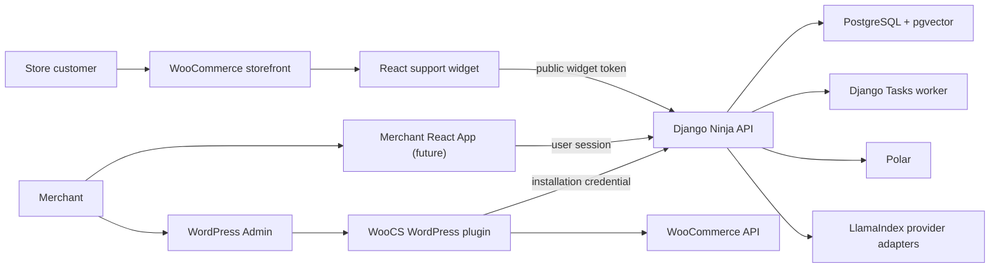
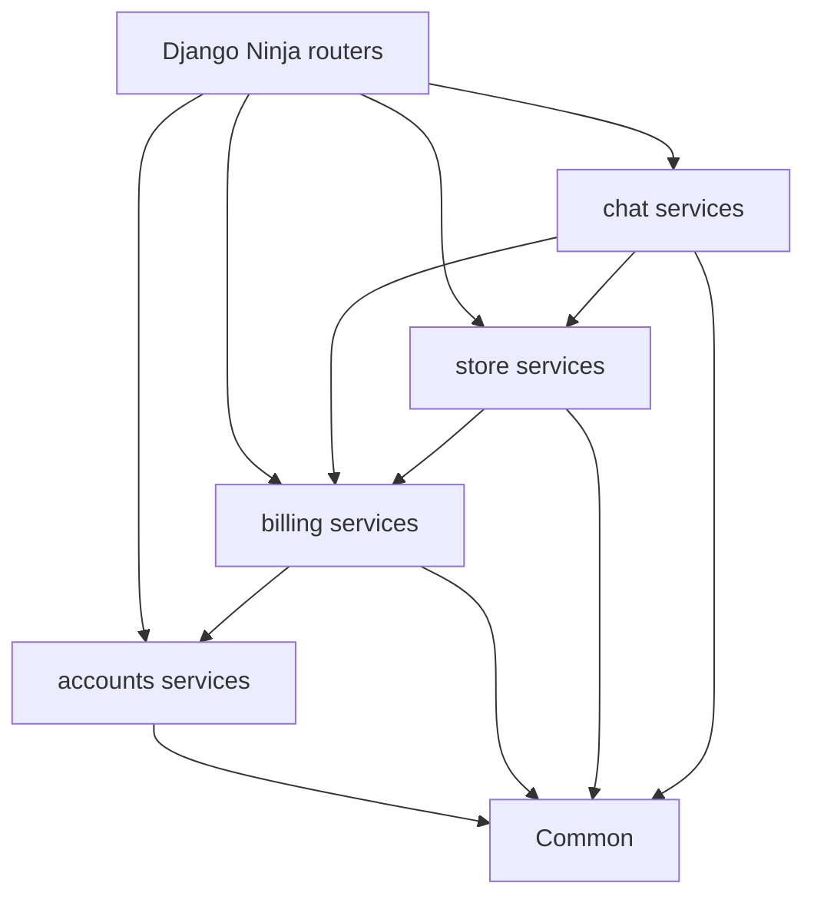
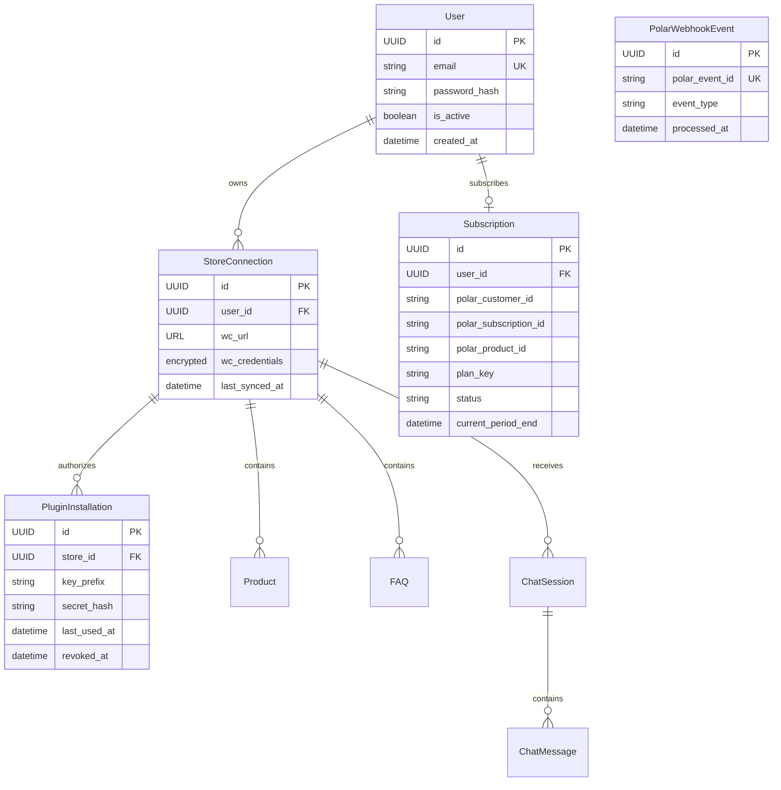
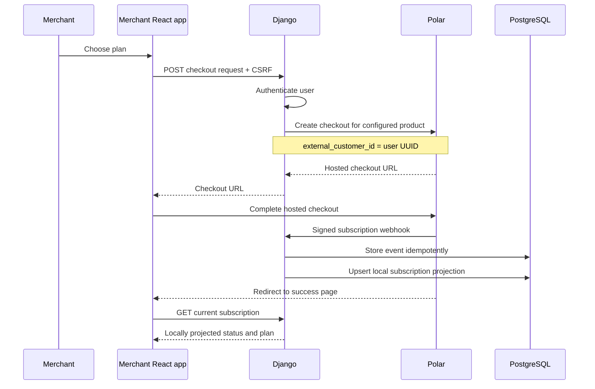
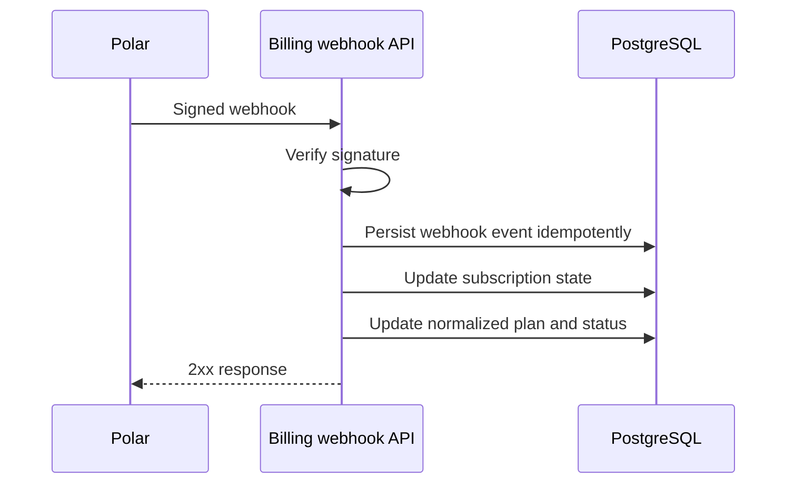
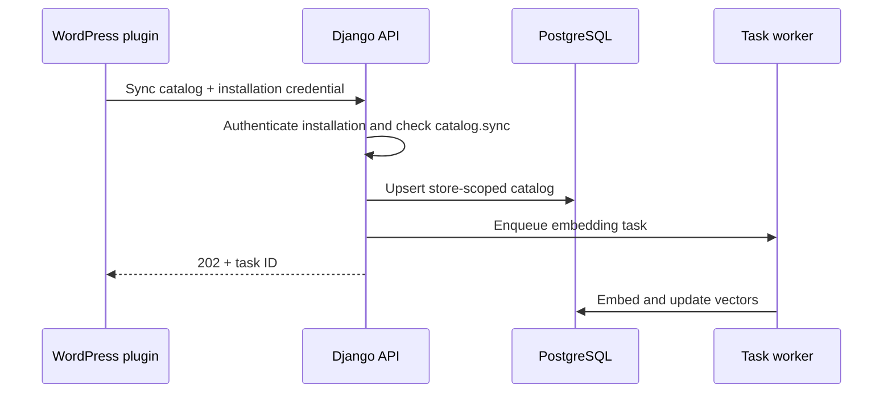
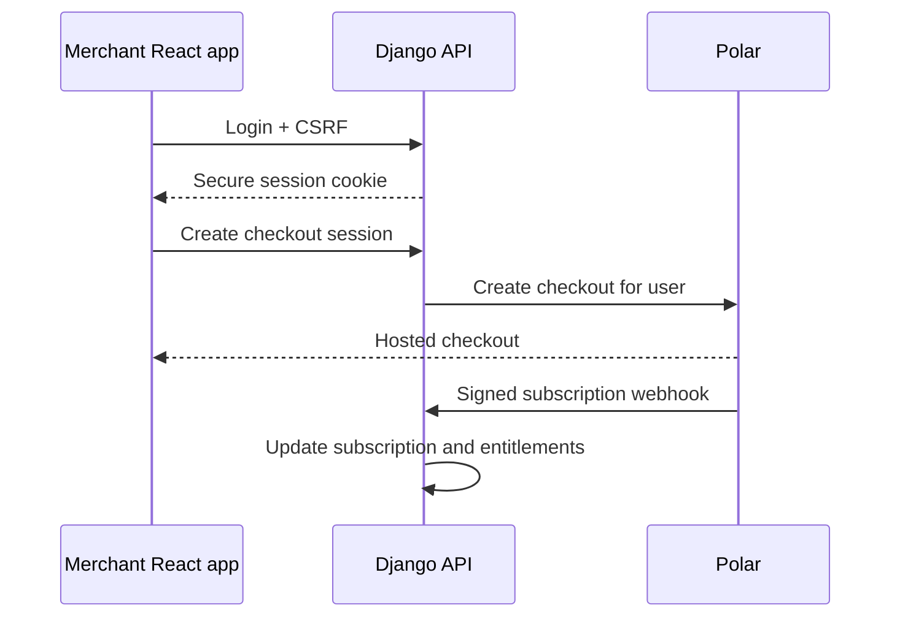

# WooCS.ai Architecture

**Status:** Living document  
**Last updated:** 2026-08-08  
**Scope:** Django backend, WordPress plugin, React applications, and the foundation for authentication and subscriptions.

This document describes system boundaries and ownership. Product behavior remains defined by [`PRD.md`](./PRD.md); implementation work is tracked under [`plans/`](./plans/).

---

## 1. Architectural principles

1. **Django is the source of truth.** Identity, store ownership, subscriptions, entitlements, catalog data, and conversations are authoritative in PostgreSQL.
2. **Store is a resource, not a user.** A WooCommerce store must not remain the authentication or billing identity.
3. **Authentication and authorization are separate.** Authentication establishes the principal; authorization checks store ownership and subscription entitlement.
4. **The WordPress plugin is a trusted machine client.** It uses a rotatable installation credential and never receives a merchant browser session.
5. **The storefront widget is an untrusted public client.** It never contains an API key, billing secret, or WooCommerce credential.
6. **Subscription checks are centralized.** Feature code asks for an entitlement; it does not branch on provider product IDs or plan names.
7. **External providers stay behind adapters.** LlamaIndex abstracts AI providers; `PolarClient` isolates the Polar API.
8. **Prefer explicit, lean modules.** Add an application or abstraction only when it owns a distinct domain boundary.

### Mental model: Django first, custom only at domain boundaries

Use this decision order for authentication and subscriptions:

1. **Use Django built-ins first:** `AbstractUser`, password hashing and validators, session middleware, CSRF, permissions, admin, and email utilities.
2. **Add only the domain model Django cannot provide:** a local Polar `Subscription` projection linked directly to the user.
3. **Keep policy in plain services:** authorization and plan limits should be small functions/services, not signals, middleware chains, or a generic policy engine.
4. **Keep external state outside core models:** Polar IDs and webhook payloads belong in `billing`; WooCommerce credentials belong in `store`.
5. **Do not add infrastructure speculatively:** no JWT, OAuth server, entitlement table, seat model, usage ledger, or SSO until a concrete requirement needs it.

The initial custom user should subclass `AbstractUser`, set email as the unique login identifier, and otherwise retain Django behavior. Merchant browser authentication uses Django sessions, not JWT. A user owns one or more stores and has at most one current WooCS subscription. `Organization` and `Membership` are intentionally deferred until shared ownership or team roles become a real requirement.

---

## 2. System context



### Current deployable units

| Unit | Location | Runtime | Responsibility |
|---|---|---|---|
| Django API | `backend/` | Host process | Domain logic, APIs, persistence, tasks |
| PostgreSQL | Docker infrastructure | Container | Relational data, vectors, task records |
| WordPress plugin | `plugin/` | WordPress/PHP | Store connection, admin UI, sync orchestration, widget injection |
| React widget | `plugin/widget/` | Browser | Customer chat experience |
| WordPress/MySQL | Docker infrastructure | Containers | Local WooCommerce environment |

### Planned deployable unit

| Unit | Suggested location | Responsibility |
|---|---|---|
| Merchant React app | `apps/dashboard/` | Account, stores, subscription, and analytics |

The merchant React app does not exist yet. WordPress admin remains the merchant surface until web authentication is implemented.

---

## 3. Backend boundaries

The current backend contains `common`, `store`, and `chat`. Authentication and billing should become separate Django apps when implemented rather than expanding `store` into a catch-all.

```text
backend/
├── config/       # settings, URL composition, deployment configuration
├── common/       # shared infrastructure, task backend, small cross-cutting utilities
├── accounts/     # future: custom user and browser auth
├── billing/      # future: Polar subscription projection and webhooks
├── store/        # WooCommerce store connections, credentials, catalog, sync
└── chat/         # sessions, messages, RAG, order lookup, escalation
```

### Dependency direction



Rules:

- `accounts` must not depend on `store`, `chat`, or provider-specific billing code.
- `billing` may reference a user but must not own user authentication.
- `store` owns WooCommerce integration and catalog state.
- `chat` may read store and entitlement state but must not mutate subscriptions.
- API routers validate transport input and call services; they do not contain billing or authentication policy.
- Cross-domain orchestration belongs in a small service, not in Django signals.

---

## 4. Domain model

### Current model

`Store` currently combines:

- WooCommerce connection and credentials;
- plugin API-key identity;
- merchant email;
- plan and subscription state;
- usage count.

This is acceptable for the PoC but is not the target model.

### Target ownership model



### Model responsibilities

| Model | Owns | Must not own |
|---|---|---|
| `User` | Login identity and ownership boundary | Store credentials, Polar event payloads |
| `StoreConnection` | WooCommerce connection and catalog scope | Human identity, subscription |
| `PluginInstallation` | Rotatable machine credential | Merchant browser login |
| `Subscription` | Minimal normalized Polar subscription state | Feature checks scattered through business code |
| Plan catalog in code/settings | Allowed features and limits | Provider webhook payloads |
| `PolarWebhookEvent` | Webhook idempotency and processing status | Subscription policy |

Do not create `Entitlement`, `UsagePeriod`, `Invoice`, or `PaymentMethod` models initially. Polar already owns payment records and its Customer Portal exposes invoices and payment methods. Add a local usage model only when WooCS sells a metered limit that cannot be derived cheaply and safely from existing application data.

### Compatibility migration

Keep the existing `Store` table while auth and billing are introduced:

1. Add the custom `User` model and nullable `Store.user` ownership field.
2. Add a claim/pairing flow and backfill existing stores to users.
3. Move plugin secrets into `PluginInstallation`; temporarily accept the legacy store API key.
4. Move plan fields to the user-owned `Subscription`; add a usage model only if metered limits require it.
5. Remove legacy fields only after all read paths use the new models.

Use additive migrations and dual-read only where required. Avoid a big-bang migration.

---

## 5. Authentication and authorization

WooCS has three principal types. They require different credentials.

| Principal | Surface | Credential | Scope |
|---|---|---|---|
| Merchant user | Future React app | Secure HTTP-only session cookie | Owned stores and subscription |
| Plugin installation | WordPress plugin | Rotatable secret in `X-WooCS-Key` | One store installation |
| Storefront visitor | React widget | Short-lived signed widget token | Public actions for one store |

### Merchant web authentication

- Use a minimal `AbstractUser` subclass with unique email as `USERNAME_FIELD`, created before production user data exists.
- Prefer server-managed sessions in secure, HTTP-only, `SameSite=Lax` cookies for the first-party React app.
- Use CSRF protection on all state-changing browser requests.
- The authenticated endpoint returns the current user, owned stores, and subscription summary.
- Store authorization is a direct ownership check. Team roles are deferred.
- Django Admin remains staff-only and is not the merchant dashboard.

### Plugin authentication

Current behavior uses one static `Store.api_key_hash`. The target is one credential per `PluginInstallation`:

- The raw secret is returned once and stored in `wp_options`.
- Django stores only a hash plus a non-secret key prefix for lookup.
- Credentials can be rotated and revoked independently.
- Every authenticated request resolves directly to one owned store.
- The plugin must never receive a user session cookie or billing-provider secret.

The existing `X-API-Key` header can remain during migration. New code should converge on one documented header rather than supporting multiple headers indefinitely.

### Widget authentication

`store_id` is an identifier, not authorization. Before production, widget configuration should include a short-lived signed token minted by Django or the plugin through an authenticated server-to-server request.

Token claims should contain only:

- store ID;
- allowed widget operations;
- issued-at and expiry;
- optional allowed origin.

The token does not identify a customer and does not grant plugin or merchant access. Order lookup requires a separate customer-verification design; knowing an order ID is insufficient authorization.

### Authorization order

Every protected request follows the same sequence:

```text
authenticate principal
→ resolve user and store scope
→ check ownership/installation permission
→ check subscription entitlement
→ execute use case
→ record usage or audit event
```

---

## 6. Polar subscription and entitlement architecture

Polar is the payment and subscription authority. Django stores only enough normalized state to authorize WooCS requests without calling Polar on every request. Business code must not check `store.plan == "pro"`; it asks one small billing service for a capability.

Example capabilities:

```text
chat.reply
catalog.sync
catalog.product_limit
team.member_limit
history.retention_days
ai.monthly_message_limit
escalation.email
```

### Minimal local models

`Subscription` begins as one row per user:

```text
user_id
polar_customer_id
polar_subscription_id
polar_product_id
plan_key
status
cancel_at_period_end
current_period_end
updated_at
```

`PolarWebhookEvent` stores the unique Polar event ID, event type, processing status, and timestamps. Retaining the full payload is optional and should have a defined retention policy.

The initial plan catalog is a typed Python dictionary in `billing/plans.py`, for example `starter`, `growth`, and `pro` mapped to capabilities and numeric limits. Polar product IDs are configuration that map to these internal plan keys. This keeps provider IDs out of business logic without creating a generic entitlement database prematurely.

### Core billing services

| Service | Responsibility |
|---|---|
| `PolarClient` | Create checkout and customer-portal sessions |
| `SubscriptionService` | Normalize verified Polar events into the local subscription row |
| `EntitlementService` | Resolve `plan_key` and status into capabilities and limits |

Polar IDs and webhook payloads remain inside `billing`. `chat` and `store` consume only normalized entitlement results. Add `UsageService` only when metered limits are introduced.

### Checkout and subscription flow



The redirect is UX only. Access is granted from a verified webhook, never from a browser success URL. Checkout should send the WooCS user UUID as Polar's `external_customer_id` so webhook reconciliation does not depend on email matching.

### Webhook flow



Requirements:

- Verify signatures against the raw request body.
- Store provider event IDs with a unique constraint for idempotency.
- Never trust plan or price values posted by a browser.
- Treat local subscription state as a projection of verified provider events.
- Define grace-period behavior for `past_due`, `cancelled`, and webhook delays.
- Increment usage transactionally and enforce limits server-side.

### Polar status policy

Initial policy:

| Polar state | WooCS access |
|---|---|
| `trialing` / `active` | Plan entitlements enabled |
| Active with `cancel_at_period_end` | Enabled until `current_period_end` |
| `past_due` | Short configurable grace period; show billing warning |
| `unpaid` / `revoked` / ended `canceled` | Paid entitlements disabled |

Polar creates a subscription automatically after checkout for a recurring product, renews it, and provides a hosted Customer Portal for cancellation, invoices, and payment-method recovery. WooCS should link to that portal instead of rebuilding billing management UI.

---

## 7. API surfaces

Keep APIs grouped by trust boundary.

| Prefix | Caller | Authentication | Purpose |
|---|---|---|---|
| `/api/widget/` | Storefront React widget | Public token | Chat and verified customer actions |
| `/api/plugin/` | WordPress plugin | Installation credential | Store sync, settings, plugin status |
| `/api/app/` | Merchant React app | Session + CSRF | Account, stores, subscription, analytics |
| `/api/webhooks/polar/` | Polar | Standard Webhooks signature | Subscription projection updates |
| `/admin/` | Internal staff | Django staff session | Operations and support |

The current `/api/stores/` routes are plugin-facing. They can remain until a versioned migration to `/api/plugin/` is justified; do not rename them only for aesthetics.

### Response conventions

- Validate all request and response bodies with Django Ninja schemas.
- Use stable machine-readable error codes alongside human-readable messages.
- Never expose provider exceptions, secrets, or stack traces.
- Pagination is required for collection endpoints.
- State-changing requests should support idempotency where retries are expected.
- API versioning should be introduced before external clients require backward compatibility.

---

## 8. WordPress plugin

The plugin is an integration client, not a second backend.

### Owns

- WordPress capability and nonce checks;
- WooCommerce catalog extraction;
- local plugin configuration;
- server-to-server calls to Django;
- widget asset loading and public configuration;
- WordPress-native admin presentation.

### Does not own

- subscription truth;
- merchant identity across sites;
- entitlement decisions;
- conversation or analytics truth;
- AI provider credentials;
- customer authentication.

### Credential storage

- Store only the installation secret required to call Django.
- Never inject it into `window.WooCS`, HTML, or browser-accessible JavaScript.
- Redact secrets in logs and admin notices.
- Support reconnect, rotation, and revocation.
- WordPress nonces protect WordPress actions; they do not authenticate calls to Django.

### Plugin connection flow

The target onboarding flow is explicit pairing rather than a permanently public registration endpoint:

1. Merchant signs in to WooCS.
2. Merchant generates a short-lived pairing code for a store they own.
3. Plugin exchanges the code server-to-server for an installation credential.
4. Django creates the `StoreConnection` and `PluginInstallation` relationship.
5. Plugin stores the returned secret once and uses it for subsequent calls.

The existing public `/api/stores/register/` endpoint is PoC behavior and should not become the production ownership mechanism.

---

## 9. React applications

### Storefront widget (`plugin/widget/`)

- Public, untrusted, and store-scoped.
- Reads non-secret configuration from `window.WooCS`.
- Calls only `/api/widget/`.
- Keeps UI/session continuity locally but treats Django as conversation truth.
- Must not infer plan access from injected config; the backend enforces entitlements.
- Must not call WooCommerce directly.

### Merchant app (future)

- First-party authenticated application.
- Owns account, stores, subscription, and cross-store analytics UI.
- Calls only `/api/app/` using the secure session cookie and CSRF token.
- Does not reuse the plugin installation key.
- May share TypeScript API types and design tokens with the widget, but should not share application state or feature components by default.

Do not turn the storefront widget into the dashboard application. Their security context, bundle constraints, and user journeys are different.

---

## 10. Main runtime flows

### Catalog sync



### Widget chat


### Merchant login and billing



---

## 11. Security invariants

- All store-scoped ORM queries include a store owned by the authenticated user or resolved from an authenticated plugin installation.
- Raw API keys, pairing codes, WooCommerce secrets, and billing secrets are never logged.
- WooCommerce credentials must be encrypted at rest before production.
- Production CORS uses an allowlist; `CORS_ALLOW_ALL_ORIGINS` is development-only.
- Widget endpoints require rate limiting and abuse controls before production.
- Widget history access must use a signed, session-bound capability; `store_id + session_id` alone is not sufficient for sensitive data.
- Order details require customer verification and must be data-minimized.
- Billing webhooks are signature-verified and idempotent.
- Staff access, merchant access, plugin access, and widget access use different principals.

---

## 12. Observability and operations

All requests and tasks should carry:

- request/correlation ID;
- user ID when available;
- store ID when available;
- principal type, never the raw credential;
- task or billing-event ID when relevant.

Measure at minimum API latency/error rate, task failures, catalog sync duration, AI latency/provider errors, conversations, entitlement denials, and billing webhook failures.

Audit events are required for login, store pairing, credential rotation/revocation, subscription changes, and staff impersonation if it is ever introduced.

---

## 13. Implementation order

1. Add `accounts` with a minimal custom user model.
2. Add merchant session authentication and `/api/app/me`.
3. Add `Store.user` ownership and a claim/backfill path for existing stores.
4. Replace public store registration with short-lived plugin pairing.
5. Add minimal Polar subscription projection and idempotent webhook ingestion.
6. Add centralized code-based plan entitlements; add usage periods only when required.
7. Enforce entitlements in catalog sync and chat entry points.
8. Add the merchant React app only after the authenticated API boundary is stable.
9. Add short-lived widget tokens, rate limiting, and verified order lookup.
10. Remove legacy Store identity, plan, and usage fields after migration.

Each phase must begin with tests for store isolation, authorization, idempotency, and denied access. Auth and billing are not complete until negative-path tests pass.

---

## 14. Deferred decisions

These choices should be recorded when implementation begins:

- Polar product IDs, currencies, prices, and trial configuration;
- email/password versus passwordless merchant login;
- session deployment topology and CSRF origin policy;
- exact plugin pairing UX;
- widget-token issuer and lifetime;
- customer verification method for order lookup;
- retention policy by plan;
- whether entitlements are evaluated from normalized tables or a cached snapshot.

They are intentionally not hardcoded in the architecture before product and deployment requirements are confirmed.

### Deferred multi-user accounts

Do not add `Organization` or `Membership` in the initial implementation. If WooCS later needs team members, shared store ownership, agency accounts, or one invoice shared by unrelated users, introduce an account/organization boundary through a separate architecture decision and migrate `Store.user` plus `Subscription.user` to that account. The current user-owned model deliberately optimizes for one merchant account with one or more stores.
