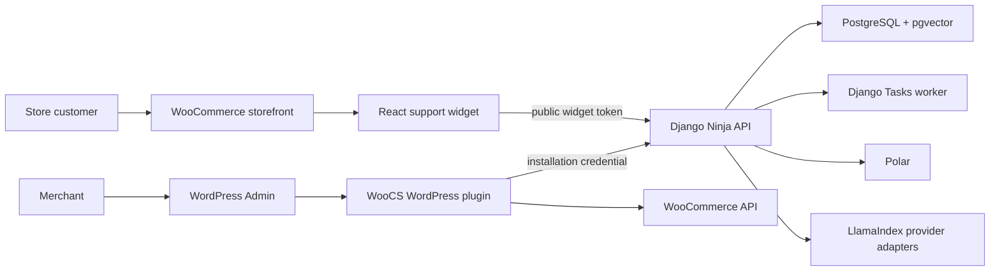
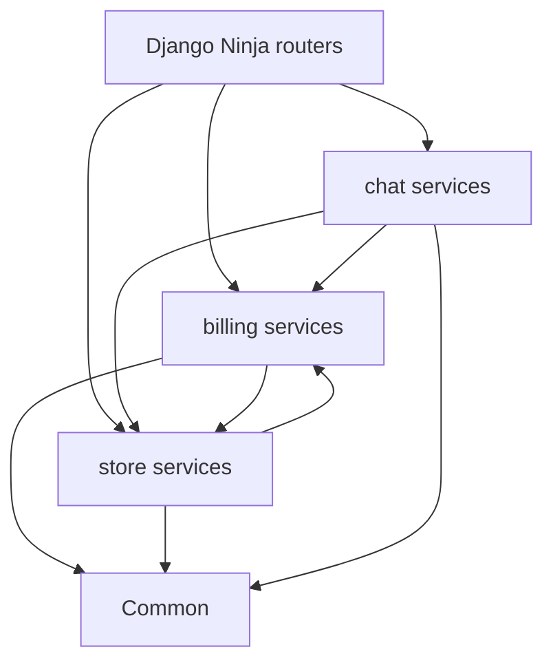
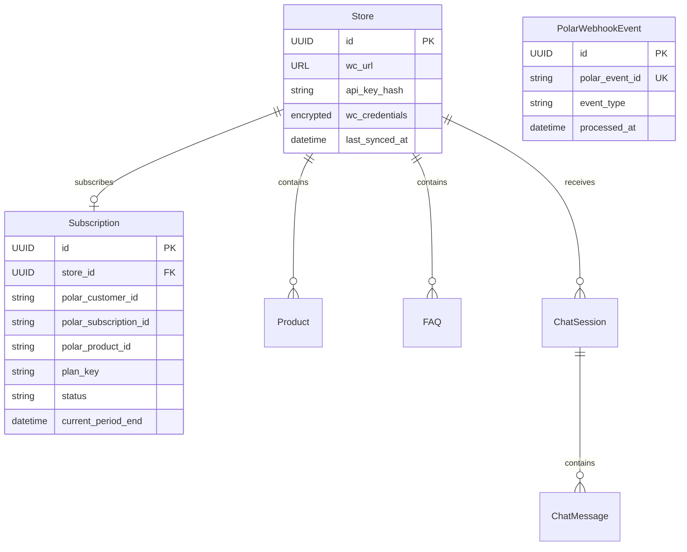
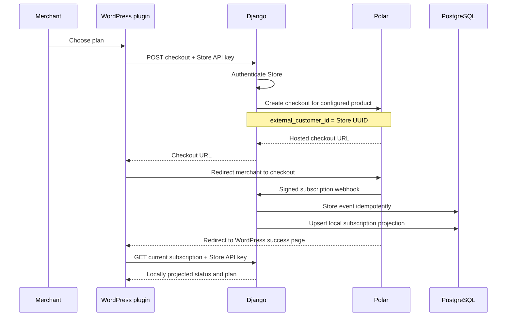
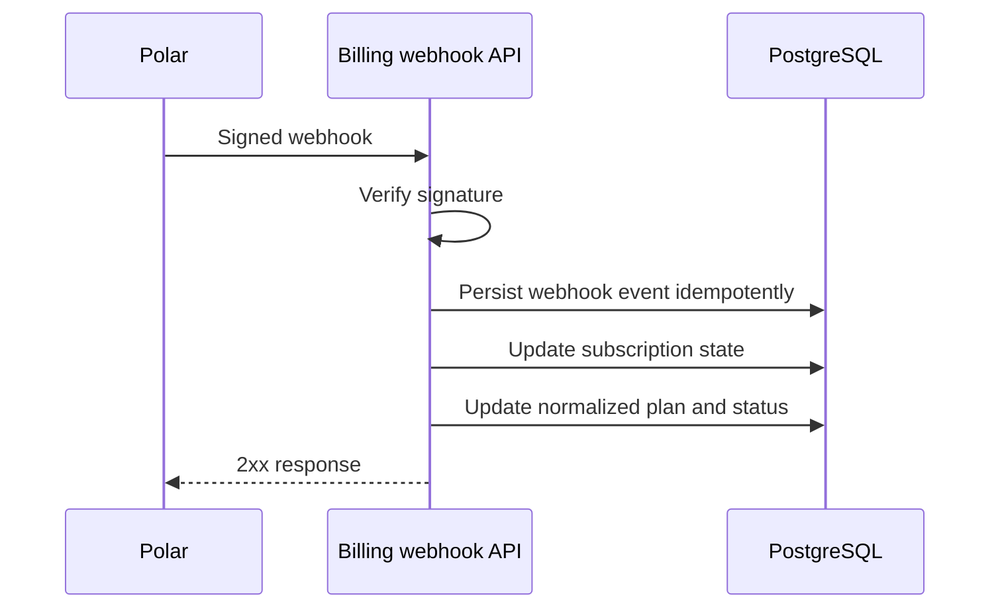
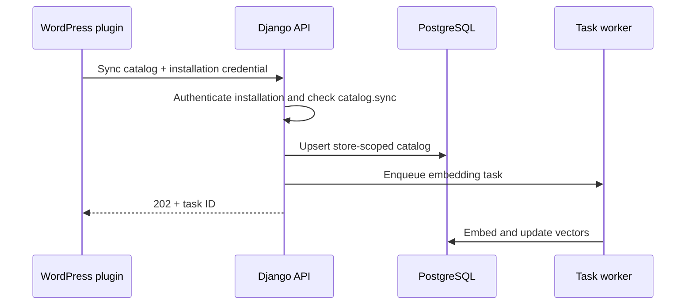
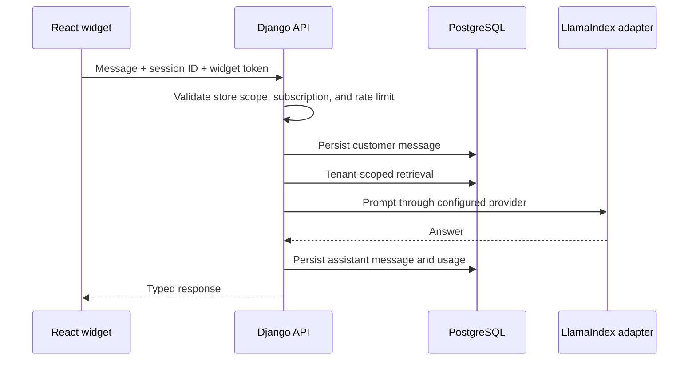
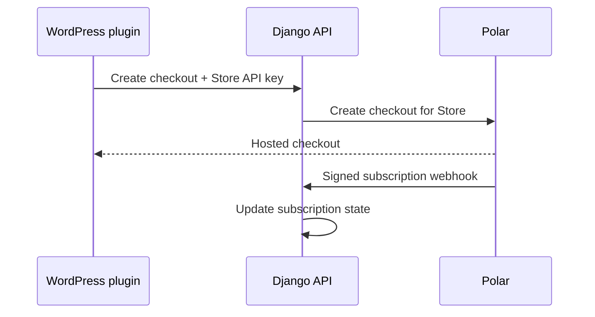

# WooCS.ai Architecture

**Status:** Living document  
**Last updated:** 2026-08-08  
**Scope:** Django backend, WordPress plugin, React applications, and the foundation for authentication and subscriptions.

This document describes system boundaries and ownership. Product behavior remains defined by [`PRD.md`](./PRD.md); implementation work is tracked under [`plans/`](./plans/).

---

## 1. Architectural principles

1. **Django is the source of truth.** Stores, subscriptions, catalog data, and conversations are authoritative in PostgreSQL.
2. **Store is the current billing boundary.** Each connected WooCommerce store has one subscription until account requirements are implemented.
3. **Authentication is intentionally deferred.** Billing uses the existing store API key; do not introduce merchant users before the product needs them.
4. **The WordPress plugin is a trusted machine client.** It uses a rotatable installation credential and never receives a merchant browser session.
5. **The storefront widget is an untrusted public client.** It never contains an API key, billing secret, or WooCommerce credential.
6. **Subscription checks are centralized.** Feature code asks whether the store has access; it does not branch on provider product IDs or plan names.
7. **External providers stay behind adapters.** LlamaIndex abstracts AI providers; `PolarClient` isolates the Polar API.
8. **Prefer explicit, lean modules.** Add an application or abstraction only when it owns a distinct domain boundary.

### Mental model: Django first, custom only at domain boundaries

Use this decision order for subscriptions:

1. **Reuse the current store identity:** plugin requests authenticate with the hashed store API key.
2. **Add only the domain model Django cannot provide:** a local Polar `Subscription` projection linked directly to `Store`.
3. **Keep policy small:** use `Subscription.is_active` and one `store_has_access` function until real plan limits exist.
4. **Keep external state outside core models:** Polar IDs and webhook payloads belong in `billing`; WooCommerce credentials belong in `store`.
5. **Do not add infrastructure speculatively:** no user model, JWT, OAuth server, organization, membership, entitlement table, seat model, usage ledger, or SSO until a concrete requirement needs it.

The current mental model is `Store → Subscription`. Polar checkout uses the store UUID as `external_customer_id`, and webhook reconciliation updates that store's subscription. Merchant accounts are a separate future decision.

---

## 2. System context



### Current deployable units

| Unit | Location | Runtime | Responsibility |
|---|---|---|---|
| Django API | `backend/` | Host process | Domain logic, APIs, persistence, tasks |
| PostgreSQL | Docker infrastructure | Container | Relational data, vectors, task records |
| WordPress plugin | `plugin/` | WordPress/PHP | Store connection, admin UI, sync orchestration, widget injection |
| React widget | `plugin/widget/` | Browser | Customer chat experience |
| WordPress/MySQL | Docker infrastructure | Containers | Local WooCommerce environment |

### Planned deployable unit

| Unit | Suggested location | Responsibility |
|---|---|---|
| Merchant React app | `apps/dashboard/` | Account, stores, subscription, and analytics |

The merchant React app does not exist yet. WordPress admin remains the merchant surface until web authentication is implemented.

---

## 3. Backend boundaries

The backend contains `common`, `billing`, `store`, and `chat`. Billing remains a separate Django app rather than expanding `store` into a catch-all.

```text
backend/
├── config/       # settings, URL composition, deployment configuration
├── common/       # shared infrastructure, task backend, small cross-cutting utilities
├── billing/      # Polar subscription projection and webhooks
├── store/        # WooCommerce store connections, credentials, catalog, sync
└── chat/         # sessions, messages, RAG, order lookup, escalation
```

### Dependency direction



Rules:

- `billing` references `Store` as the current subscription boundary.
- `store` owns WooCommerce integration and catalog state.
- `chat` may read Store access state but must not mutate subscriptions.
- API routers validate transport input and call services; they do not contain billing or authentication policy.
- Cross-domain orchestration belongs in a small service, not in Django signals.

---

## 4. Domain model

### Current model

`Store` currently combines:

- WooCommerce connection and credentials;
- plugin API-key identity;
- merchant email;
- plan and subscription state;
- usage count.

Subscription state lives only in the dedicated billing projection; legacy Store billing fields are removed after their data migration.

### Target ownership model



### Model responsibilities

| Model | Owns | Must not own |
|---|---|---|
| `Store` | WooCommerce connection, plugin identity, and current billing boundary | Polar event payloads |
| `Subscription` | Minimal normalized Polar subscription state and active-state rule | Feature checks scattered through business code |
| `PolarWebhookEvent` | Webhook idempotency and processing status | Subscription policy |

Do not create `Entitlement`, `UsagePeriod`, `Invoice`, or `PaymentMethod` models initially. Polar already owns payment records and its Customer Portal exposes invoices and payment methods. Add a local usage model only when WooCS sells a metered limit that cannot be derived cheaply and safely from existing application data.

### Compatibility migration

The billing migration creates a `Subscription` projection from the old Store billing fields before a following Store migration removes those fields. Runtime code has one source of truth and no dual-read fallback.

---

## 5. Current authentication boundary

WooCS currently has two client types:

| Client | Credential | Scope |
|---|---|---|
| WordPress plugin | `X-API-Key` | One Store, including its subscription endpoints |
| Storefront widget | Public store/session identifiers | Public widget operations for one Store |

Billing checkout, subscription status, and Customer Portal creation are plugin-facing operations authenticated by the existing Store API key. There is no merchant account or browser session API at this stage.

The raw store API key is returned once, stored in `wp_options`, and represented only by its SHA-256 hash in Django. It must never be injected into widget JavaScript.

### Widget authentication

`store_id` is an identifier, not authorization. Before production, widget configuration should include a short-lived signed token minted by Django or the plugin through an authenticated server-to-server request.

Token claims should contain only:

- store ID;
- allowed widget operations;
- issued-at and expiry;
- optional allowed origin.

The token does not identify a customer and does not grant plugin or merchant access. Order lookup requires a separate customer-verification design; knowing an order ID is insufficient authorization.

### Authorization order

Every protected request follows the same sequence:

```text
authenticate principal
→ resolve store scope
→ check active subscription
→ execute use case
→ record usage or audit event
```

---

## 6. Polar subscription architecture

Polar is the payment and subscription authority. Django stores only enough normalized state to authorize WooCS requests without calling Polar on every request. For now, both chat and catalog sync need the same answer: whether the Store subscription is active.

### Minimal local models

`Subscription` is one row per store:

```text
store_id
polar_customer_id
polar_subscription_id
polar_product_id
plan_key
status
cancel_at_period_end
current_period_end
updated_at
```

`PolarWebhookEvent` stores the unique Polar event ID, event type, processing status, and timestamps. Retaining the full payload is optional and should have a defined retention policy.

Polar product IDs are configured as a small `plan_key → product_id` mapping for checkout and webhook normalization. Add feature or usage policy only after plans actually differ in product behavior.

### Core billing services

| Service | Responsibility |
|---|---|
| `PolarClient` | Create checkout and customer-portal sessions |
| `PolarWebhookService` | Normalize verified Polar events into the local subscription row |
| `store_has_access` | Return the Store subscription's active state |

Polar IDs and webhook payloads remain inside `billing`. `chat` and `store` consume only the active-state result. Add usage or capability policy only when a paid plan requires it.

### Checkout and subscription flow



The redirect is UX only. Access is granted from a verified webhook, never from a browser success URL. Checkout sends the WooCS Store UUID as Polar's `external_customer_id`.

### Webhook flow



Requirements:

- Verify signatures against the raw request body.
- Store provider event IDs with a unique constraint for idempotency.
- Never trust plan or price values posted by a browser.
- Treat local subscription state as a projection of verified provider events.
- Define grace-period behavior for `past_due`, `cancelled`, and webhook delays.
- If metered limits are introduced, increment usage transactionally and enforce them server-side.

### Polar status policy

Initial policy:

| Polar state | WooCS access |
|---|---|
| `trialing` / `active` | Access enabled |
| Active with `cancel_at_period_end` | Enabled until `current_period_end` |
| `past_due` | Short configurable grace period; show billing warning |
| `unpaid` / `revoked` / ended `canceled` | Access disabled |

Polar creates a subscription automatically after checkout for a recurring product, renews it, and provides a hosted Customer Portal for cancellation, invoices, and payment-method recovery. WooCS should link to that portal instead of rebuilding billing management UI.

---

## 7. API surfaces

Keep APIs grouped by trust boundary.

| Prefix | Caller | Authentication | Purpose |
|---|---|---|---|
| `/api/widget/` | Storefront React widget | Public token | Chat and verified customer actions |
| `/api/stores/` | WordPress plugin | Store API key | Store sync, subscription, billing portal, status |
| `/api/webhooks/polar/` | Polar | Standard Webhooks signature | Subscription projection updates |
| `/admin/` | Internal staff | Django staff session | Operations and support |

The current `/api/stores/` routes are plugin-facing. They can remain until a versioned migration to `/api/plugin/` is justified; do not rename them only for aesthetics.

### Response conventions

- Validate all request and response bodies with Django Ninja schemas.
- Use stable machine-readable error codes alongside human-readable messages.
- Never expose provider exceptions, secrets, or stack traces.
- Pagination is required for collection endpoints.
- State-changing requests should support idempotency where retries are expected.
- API versioning should be introduced before external clients require backward compatibility.

---

## 8. WordPress plugin

The plugin is an integration client, not a second backend.

### Owns

- WordPress capability and nonce checks;
- WooCommerce catalog extraction;
- local plugin configuration;
- server-to-server calls to Django;
- widget asset loading and public configuration;
- WordPress-native admin presentation.

### Does not own

- subscription truth;
- merchant identity across sites;
- subscription access decisions;
- conversation or analytics truth;
- AI provider credentials;
- customer authentication.

### Credential storage

- Store only the installation secret required to call Django.
- Never inject it into `window.WooCS`, HTML, or browser-accessible JavaScript.
- Redact secrets in logs and admin notices.
- Support reconnect, rotation, and revocation.
- WordPress nonces protect WordPress actions; they do not authenticate calls to Django.

### Plugin connection flow

The current plugin registers a Store through `/api/stores/register/`, stores the returned API key once, and uses it for sync and billing calls. A more advanced account/pairing flow is deferred with merchant authentication.

---

## 9. React applications

### Storefront widget (`plugin/widget/`)

- Public, untrusted, and store-scoped.
- Reads non-secret configuration from `window.WooCS`.
- Calls only `/api/widget/`.
- Keeps UI/session continuity locally but treats Django as conversation truth.
- Must not infer access from injected config; the backend enforces subscription state.
- Must not call WooCommerce directly.

### Merchant app (future)

- Not implemented in the current billing phase.
- Its account and authentication model must be designed separately when required.
- It must not cause speculative user, organization, or membership models now.

Do not turn the storefront widget into the dashboard application. Their security context, bundle constraints, and user journeys are different.

---

## 10. Main runtime flows

### Catalog sync



### Widget chat



### Plugin billing



---

## 11. Security invariants

- All plugin billing queries use the Store resolved from `X-API-Key`, never a caller-supplied store ID.
- Raw API keys, pairing codes, WooCommerce secrets, and billing secrets are never logged.
- WooCommerce credentials must be encrypted at rest before production.
- Production CORS uses an allowlist; `CORS_ALLOW_ALL_ORIGINS` is development-only.
- Widget endpoints require rate limiting and abuse controls before production.
- Widget history access must use a signed, session-bound capability; `store_id + session_id` alone is not sufficient for sensitive data.
- Order details require customer verification and must be data-minimized.
- Billing webhooks are signature-verified and idempotent.
- Staff access, merchant access, plugin access, and widget access use different principals.

---

## 12. Observability and operations

All requests and tasks should carry:

- request/correlation ID;
- store ID when available;
- principal type, never the raw credential;
- task or billing-event ID when relevant.

Measure at minimum API latency/error rate, task failures, catalog sync duration, AI latency/provider errors, conversations, subscription denials, and billing webhook failures.

Audit events are required for subscription changes, webhook failures, and API-key rotation if it is introduced.

---

## 13. Implementation order

1. Add the Store-owned Polar subscription projection and idempotent webhook ingestion.
2. Add plugin-authenticated checkout, subscription status, and Customer Portal endpoints.
3. Add the WordPress Plan & Billing journey using Polar-hosted checkout and portal pages.
4. Enforce one active-subscription gate in catalog sync and chat entry points.
5. Configure Polar sandbox products and verify the end-to-end webhook flow.
6. Remove legacy Store plan/status fields after migration compatibility is no longer needed.
7. Add short-lived widget tokens, rate limiting, and verified order lookup separately.

Each phase must begin with tests for store isolation, authorization, idempotency, and denied access. Auth and billing are not complete until negative-path tests pass.

---

## 14. Deferred decisions

These choices should be recorded when implementation begins:

- Polar product IDs, currencies, prices, and trial configuration;
- merchant account and authentication requirements;
- widget-token issuer and lifetime;
- customer verification method for order lookup;
- retention policy by plan;
- whether future plan differences require usage or capability policy.

They are intentionally not hardcoded in the architecture before product and deployment requirements are confirmed.

### Deferred merchant accounts

Do not add `User`, `Organization`, or `Membership` ownership to WooCS in the billing phase. If a standalone merchant dashboard, multiple stores per billing account, or team access becomes a real requirement, define that identity boundary in a separate architecture decision and migrate Store-owned subscriptions deliberately.
