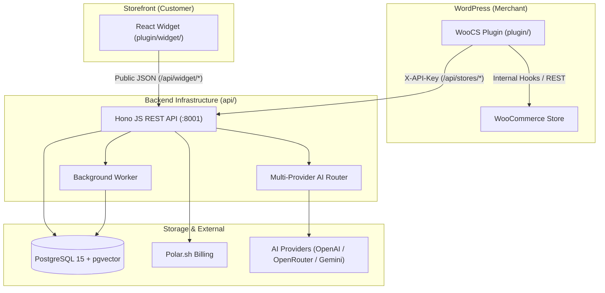
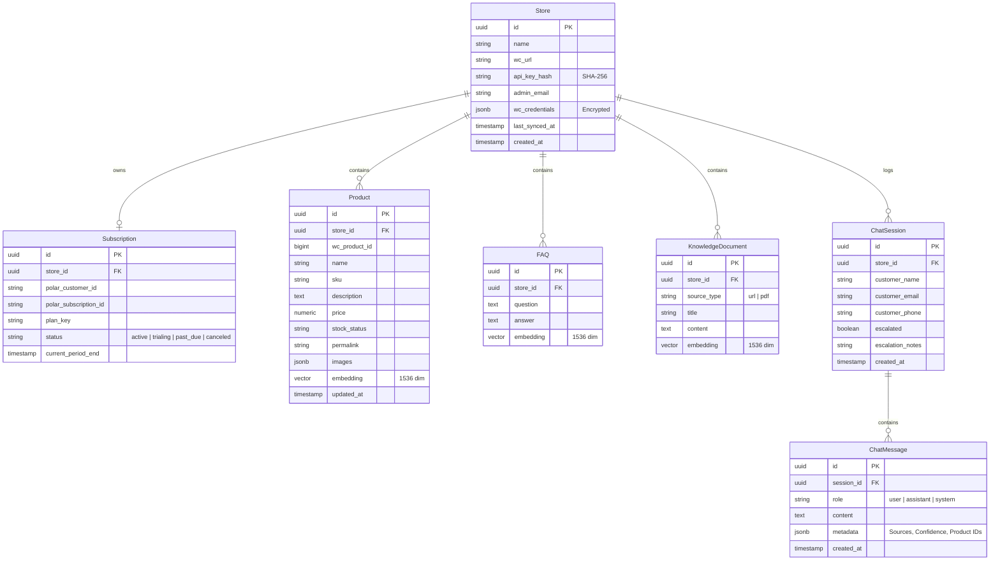
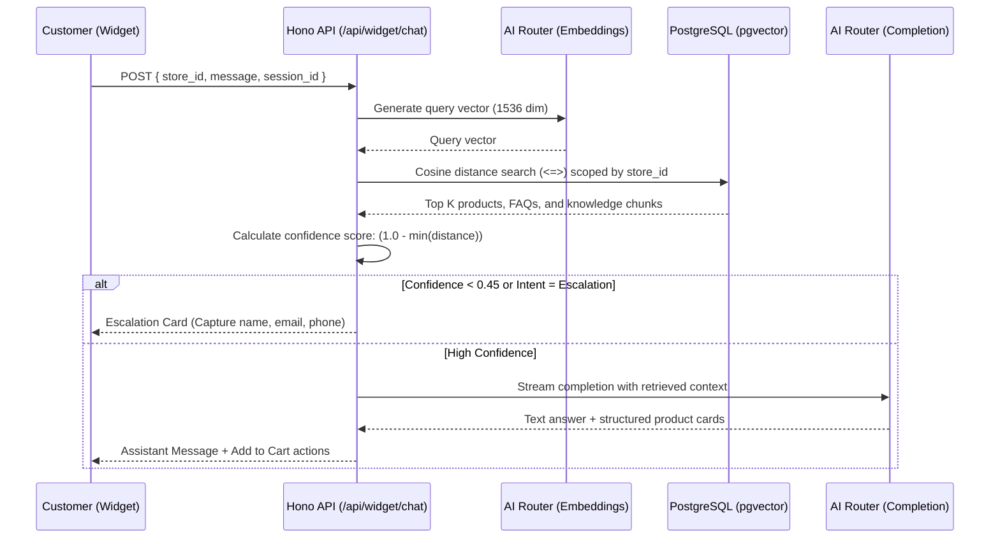
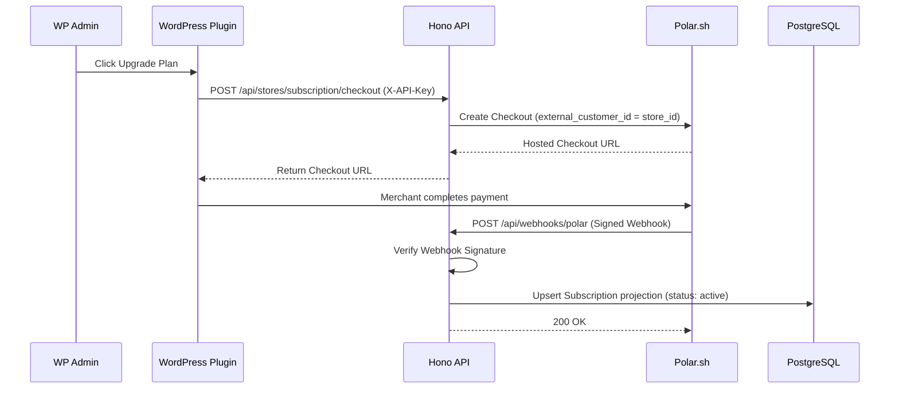

# WooCS.ai — Technical Architecture & System Design

**Scope:** Hono JS API backend (`api/`), WordPress plugin (`plugin/`), React storefront widget (`plugin/widget/`), PostgreSQL + pgvector database, and multi-provider AI Router.

---

## 1. System Topology & Overview

```
┌──────────────────────────────────────────────────────────┐
│  Storefront (Customer-facing)                            │
│  React Widget (Vite)  →  POST /api/widget/chat           │
│                       →  POST /api/widget/chat/escalate  │
│                       →  GET  /api/widget/orders/:id     │
└──────────────────────┬───────────────────────────────────┘
                       │ HTTP (JSON)
┌──────────────────────▼───────────────────────────────────┐
│  Hono JS Backend (api/ — Node.js / Cloudflare Workers)   │
│  Routers: store · chat/widget · billing · internal       │
│  AI Router: Multi-provider failover + Circuit Breaker    │
└──────┬──────────────────────────────┬────────────────────┘
       │                              │
┌──────▼─────────────────────┐ ┌──────▼────────────────────┐
│ PostgreSQL 15 + pgvector   │ │ Asynchronous Worker       │
│ (Catalog, Vectors, Memory) │ │ (Embeddings & Catalog DB) │
└────────────────────────────┘ └───────────────────────────┘

┌──────────────────────────────────────────────────────────┐
│  WordPress Plugin (PHP 8.1+)                             │
│  Pulls WC catalog     →  POST /api/stores/sync           │
│  Admin Dashboard      →  Settings · Sync · FAQs · Preview│
└──────────────────────────────────────────────────────────┘
```



---

## 2. Directory & Module Boundaries

```text
woocs/
├── api/                  # Hono JS backend (Node.js & Cloudflare Workers compatible)
│   ├── src/
│   │   ├── config/       # Env config, DB pool, AI router JSON parsing
│   │   ├── middleware/   # API key auth, health secret check, rate limiting
│   │   ├── routes/       # /api/stores, /api/widget, /api/billing, /api/internal
│   │   ├── services/     # AI Router, RAG pipeline, Sync worker, Polar client
│   │   └── types/        # TypeScript interfaces and DTOs
│   └── tests/            # Vitest unit & contract test suites (27 files / 142 tests)
├── plugin/               # WordPress Plugin (PHP 8.1+)
│   ├── src/              # Controllers, sync client, admin settings UI
│   └── widget/           # React 18 + Vite storefront chat client
└── compose.dev.yml       # Docker/Podman services (Postgres + pgvector, MySQL, WordPress)
```

---

## 3. Database Schema (PostgreSQL + pgvector)



---

## 4. Multi-Provider AI Router Architecture

The AI layer (`api/src/services/ai.ts`) reads dynamic provider chains from JSON configuration with automated failover and circuit breaking:

```mermaid
flowchart TD
    Req["Incoming Chat / Embedding Request"] --> Router["AIRouterService"]
    Router --> P1{"Provider 1 Active?"}
    
    P1 -->|Yes| Call1["Call Provider 1 (e.g. OpenAI)"]
    P1 -->|Cooldown / Disabled| P2{"Provider 2 Active?"}
    
    Call1 -->|Success (200)| Ret["Return Output"]
    Call1 -->|429 / 5xx Error| MarkCooldown["Set 60s Circuit Breaker Cooldown"]
    MarkCooldown --> P2
    
    P2 -->|Yes| Call2["Call Provider 2 (e.g. OpenRouter / Gemini)"]
    P2 -->|Cooldown / Disabled| P3["Provider 3 Fallback"]
    
    Call2 -->|Success| Ret
    Call2 -->|Failure| P3
    P3 -->|Success| Ret
    P3 -->|Exhausted| Escalate["Trigger Human Escalation Fallback"]
```

---

## 5. RAG Retrieval & Confidence Scoring



---

## 6. Polar Billing & Webhook Lifecycle



---

## 7. Security & Trust Boundaries

| Surface | Authentication | Scope & Invariants |
|---|---|---|
| **Plugin API** (`/api/stores/*`) | `X-API-Key` (SHA-256 hashed in DB) | Server-to-server only. Never exposed to browser. Full store catalog & sync authority. |
| **Widget API** (`/api/widget/*`) | Keyless (scoped by `store_id`) | Untrusted browser client. Read-only catalog RAG, session persistence, escalation dispatch. |
| **Polar Webhooks** (`/api/webhooks/polar`) | `Standard-Webhooks-Signature` | Idempotent event persistence. Authoritative subscription gate updater. |
| **Internal Health Check** (`/api/internal/*`) | `X-Health-Key` / `?key=` | Obfuscated route. Returns internal database latency, memory, and AI provider status. |
